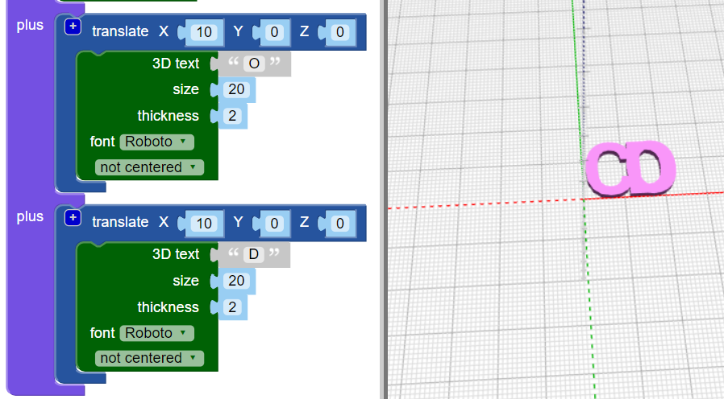

## ربط الحروف مع بعضها البعض

بعد ذلك، ستنضم إلى الحروف معا حتى تبدو حلقة المفتاح هكذا:

--- task ---

قم بتغيير التعليمات البرمجية الخاصة بك بحيث تقوم فقط بإنشاء الحرف 'C'.

--- /task --- --- task ---

الكتلة ` union `{:class="blockscadsetops"} تربط الأشكال معا. ابدأ بالحرفين الأولين من "CODER".

الكتل مرقمة بالألوان. انظر تحت `Set Ops `{:class="blockscadsetops"} للعثور على `union`{:class="blockscadsetops"}.

لاحظ أن الكتلة `3D Text`{:class="blockscad3dshapes"} موجودة تحت `Text`{:class="blockscadstext"}، بالرغم من أنها خضراء.

--- /task --- --- task ---

انقر فوق **Render** وسترى أن هناك مشكلة: 'C' و 'O' في نفس المكان.

تحتاج إلى تحريك 'O' على طول المحور السيني بحيث يأتي بعد 'C'.

--- /task --- --- task ---

قم بإضافة كتلة ` translate `{:class="blockscadtransforms"} وضبط قيمة `X` إلى `10` لتحريك الحرف 'O'١٠مم على طول المحور السيني.

الآن، يجب أن تكون الحروف ملامسة، ولكن ليس على رأس بعضها البعض.

--- /task --- --- task ---

انقر فوق الزر `[+]` على القالب `union`{:class="blockscadsetops"} لإضافة مساحة لكتلة أخرى.

--- /task --- --- task ---

انقر بالزر الأيمن على الكتلة ` translate `{:class="blockscadtransforms"} وحدد ** Duplicate ** لإنشاء نسخة.

--- /task --- --- task ---

اسحب النسخة إلى القالب `union`{:class="blockscadsetops"} وقم بتغيير 'O' إلى 'D'.

--- /task --- --- task ---

قم بتغيير القيمة `X` من الكتلة الثانية ` translate `{:class="blockscadtransforms"} بحيث يكون 'D' في المكان الصحيح.

--- hints --- --- hint ---

فكر فيما قمت بتغييره لجعل "O" تنتقل إليه بعد "C". يبدأ "D" في نفس المكان الذي يبدأ فيه "C"، وتحتاج إلى نقله بعد "O".

--- /hint --- --- hint ---

    

--- /hint --- --- /hints ---

--- /task --- --- task ---

الآن، أضف 'E' و 'R' لإنهاء كلمة 'CODER'.

تأكد من أن جميع الحروف ملامسة، وأنه لا توجد فجوات بين أي من الحروف.

--- hints --- --- hint ---

تحتاج إلى النقر على الكتلة `+` في `union`{:class="blockscadsetops"} لإضافة مساحة لحرفين آخرين.

--- /hint --- --- hint ---

يمكنك تكرار التعليمات البرمجية التي استخدمتها لإنشاء 'D' ثم تغيير الحروف والقيم `X` .

--- /hint --- --- hint ---

    

--- /hint --- --- /hints ---

--- /task --- --- task ---

انظر عن كثب - هل "E" و "R" مترابطان معًا؟ إذا لم تكن كذلك ، فأنت بحاجة إلى تعديل التعليمات البرمجية الخاصة بك.

--- /task ---

