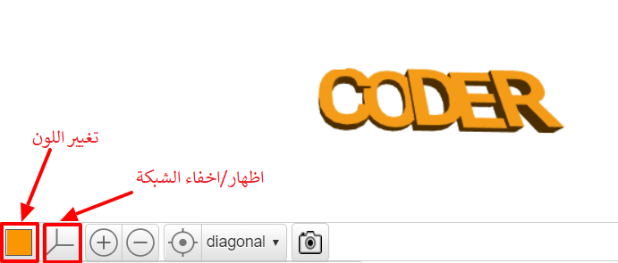

## تغيير السماكة

بعد ذلك، قم بتغيير سماكة الحروف للمساعدة في فصلها، وجعل حلقة المفتاح الخاصة بك أفضل.

--- task ---

سماكة الحروف حاليا 2 مم.

قم بتغيير سماكة "C" و "D" و "R" بحيث تكون بسُمك 3 مم.

--- hints ---
 --- hint ---

تغيير قيمة `السمك ` للنص.

--- /hint --- --- hint ---

قم بتغيير قيمة سمك `` لـ 'C', 'D', و 'R' إلى `3` بحيث تصبح أكثر سماكة من 'O' و 'E'.

--- /hint ------ /hints ---

--- /task ---   
--- task ---

يمكنك النقر على المربع الملون لتغيير لون النموذج الخاص بك بطريقة عرض النتيجة النهائية. إذا طبعت النموذج ثلاثي الأبعاد، فإن لون حلقة المفاتيح سيعتمد على لون الفتيل البلاستيكي (مادة الطباعة) الذي تستخدمه، ولكن من المفيد أن تكون قادراً على تجربة ألوان مختلفة بطريقة عرض النتيجة النهائية.

يمكنك أيضًا إظهار الشبكة وإخفائها. جرب الأزرار الأخرى وشاهد ما يفعلون.

يمكنك سحب النموذج الخاص بك لعرضه من زوايا مختلفة أيضا.

--- /task ---
