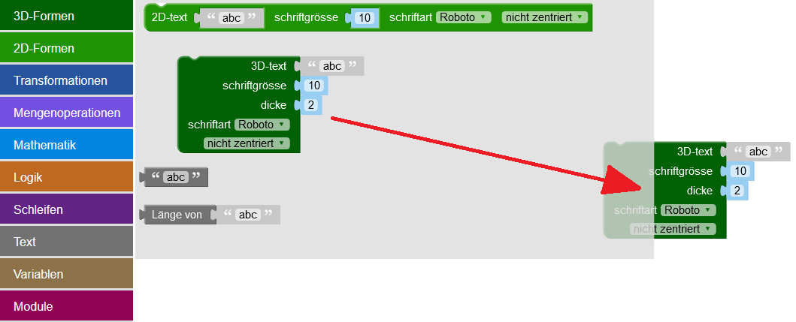
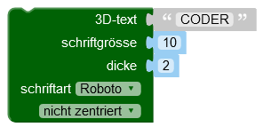
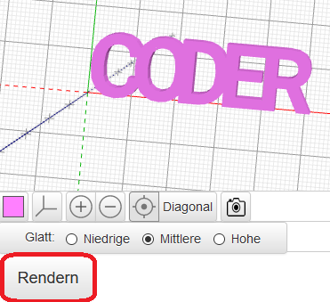
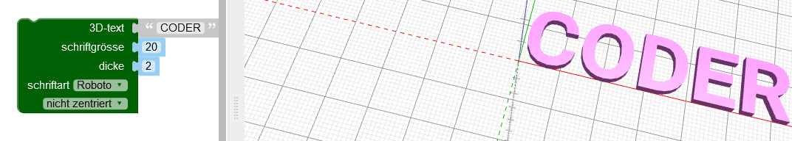

## Erstelle den 3D-Text

--- task ---

Öffne den BlocksCAD-Editor in einem Webbrowser. [blockscad3d.com/editor/](https://www.blockscad3d.com/editor/){:target="_ blank"}.

Du kannst Blöcke ziehen und ablegen um einen Code zu schreiben, der 3D-Objekte erstellt.

--- /task ---

Benutze zuerst das 3D-Textwerkzeug, um einige 3D-Buchstaben zu erstellen.

--- task ---

Klicke auf `Text`{:class="blockscadtext"} und ziehe dann einen `3D-Text`{:class="blockscadtext"} Baustein auf die Leinwand.

--- /task --- --- task ---

Ändere die `3D-Text` Eingabe zu 'CODER'.

--- /task --- --- task ---

Klicke auf die **Rendern** Schaltfläche um zu sehen, wie es aussieht.

Beim Rendern wird ein Bild aus einem 3D-Modell erstellt, damit wir sehen können, wie es aussieht.

--- /task --- --- task ---

Um die Buchstaben zu vergrößern, ändere die `Größe` auf `20` — das bedeutet Schriftgröße 20.

Klicke erneut auf **Rendern**, um das Ergebnis zu sehen.

--- /task ---

Wenn du das jetzt erstellte Modell in 3D druckst, erhältst du fünf separate Buchstaben, da diese nicht miteinander verbunden sind. Das wäre kein sehr guter Schlüsselanhänger!

	

	
	

 
