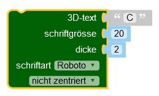
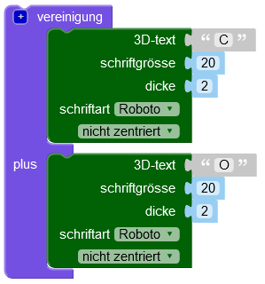
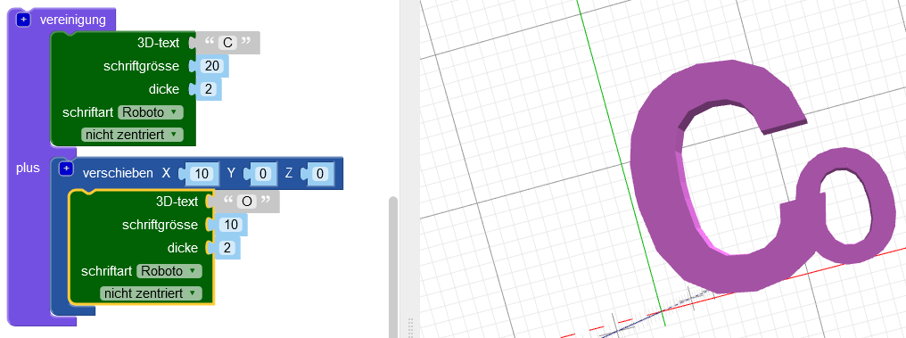
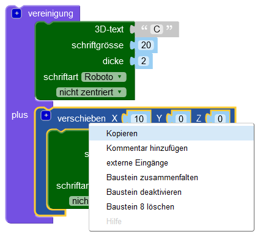
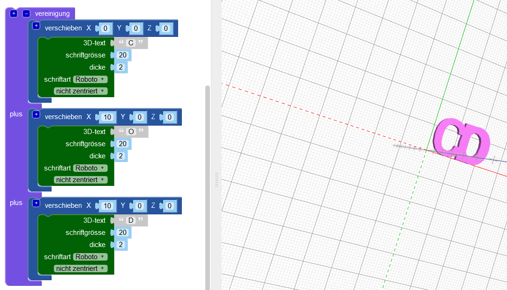
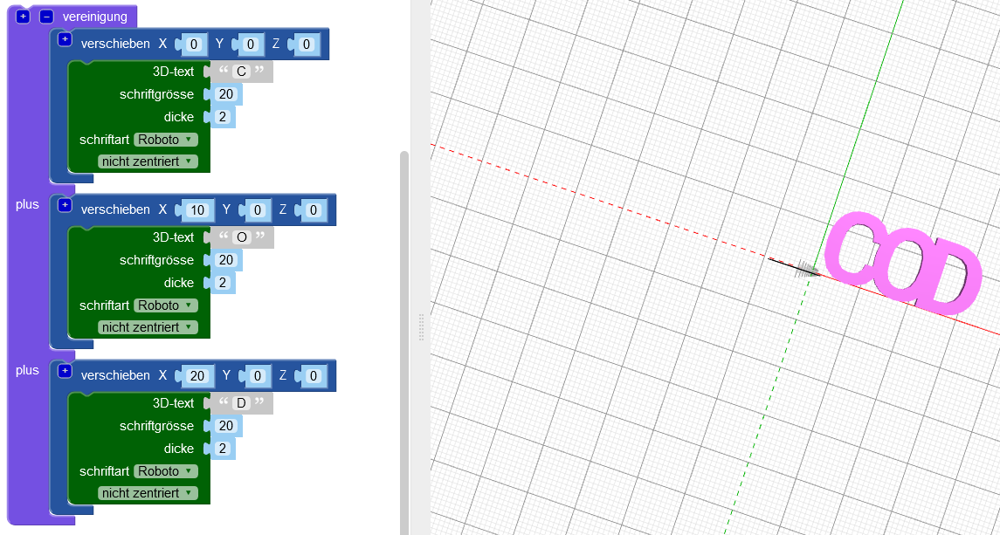
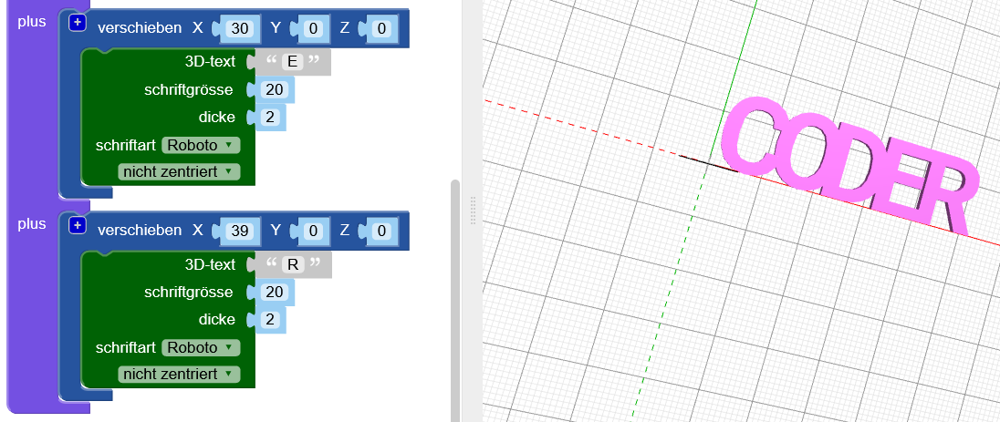

## Verbinde die Buchstaben miteinander

Als Nächstes verbinde die Buchstaben, sodass der Schlüsselanhänger folgendermaßen aussieht:

--- task ---

Ändere deinen Code so, dass nur der Buchstabe 'C' erstellt wird.

--- /task --- --- task ---

Der Block `vereinigung`{:class="blockscadsetops"} verbindet Buchstaben miteinander. Beginne mit den ersten beiden Buchstaben von 'CODER'.

Die Blöcke sind farbcodiert. Schau nach unter `Mengenoperationen`{:class="blockscadsetops"} , um den `vereinigung`{:class="blockscadsetops"}-Block zu finden.

Beachte, dass sich der `3D-Text`{:class="blockscad3dshapes"} Block unter `Text`{:class="blockscadstext"} befindet, obwohl er grün ist.

--- /task --- --- task ---

Klicke auf **Rendern** und du wirst sehen, dass es ein Problem gibt: Das 'C' und das 'O' befinden sich an derselben Stelle.

Du musst das 'O' entlang der X-Achse bewegen, damit es nach dem 'C' kommt.

--- /task --- --- task ---

Füge einen `verschieben`{:class="blockscadtransforms"}-Block hinzu und setzen den Wert `X` auf `10` um das 'O' 10mm entlang der X-Achse zu bewegen.

Jetzt sollten sich die Buchstaben berühren, aber nicht an der Oberseite.

--- /task --- --- task ---

Klicke auf die `[+]` Schaltfläche des `vereinigung`{:class ="blockscadsetops"}-Blocks, um Platz für einen weiteren Block hinzuzufügen.

--- /task --- --- task ---

Klicke mit der rechten Maustaste auf den `verschieben`{:class="blockscadtransforms"}-Block und wähle **kopieren** aus, um eine Kopie zu erstellen.

--- /task --- --- task ---

Zieh die Kopie in den `vereinigung`{:class="blockscadsetops"}-Block und ändere das 'O' in ein 'D'.

--- /task --- --- task ---

Ändere den `X`-Wert des zweiten `verschieben`{:class="blockscadtransforms"}-Blocks, sodass 'D' an der richtigen Stelle ist.

--- hints --- --- hint ---

Denke daran, was du geändert hast, um das 'O' hinter das 'C' zu verschieben. Das 'D' beginnt an derselben Stelle wie das 'C' und du musst es hinter das 'O' verschieben.

--- /hint --- --- hint ---

    

--- /hint --- --- /hints ---

--- /task --- --- task ---

Füge nun ein 'E' und ein 'R' hinzu, um das Wort 'CODER' zu beenden.

Stelle sicher, dass sich alle Buchstaben berühren und dass zwischen den Buchstaben keine Lücken bestehen.

--- hints --- --- hint ---

Klicke auf die `[+]` Schaltfläche des `vereinigung`{:class ="blockscadsetops"}-Blocks, um Platz für einen weiteren Block hinzuzufügen.

--- /hint --- --- hint ---

Du kannst den Code, mit dem du das 'D' erstellt hast, duplizieren und dann die Buchstaben und die `X`-Werte ändern.

--- /hint --- --- hint ---

    

--- /hint --- --- /hints ---

--- /task --- --- task ---

Schau genau hin - sind das 'E' und 'R' miteinander verbunden? Falls nicht, musst du deinen Code anpassen.

--- /task ---

