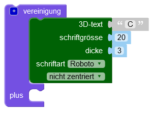
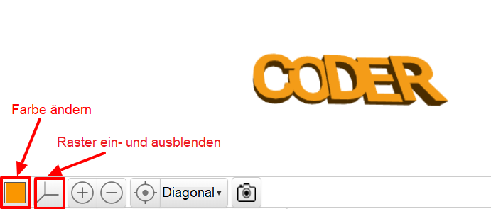

## Ändere die Dicke

Verändere als nächstes die Dicke der Buchstaben, um sie besser zu trennen und deinen Schlüsselanhänger zu verbessern.

--- task ---

Die Buchstaben sind jetzt 2mm dick.

Ändere die Dicke des 'C', 'D' und 'R', sodass sie 3 mm dick sind.

--- hints --- --- hint ---

Ändere den Wert `dicke` für den Text.

--- /hint --- --- hint ---

Ändere den `dicke` Wert für 'C', 'D' und 'R' auf `3`, sodass sie dicker als das 'O' und 'E' sind.

--- /hint --- --- /hints ---

--- /task ---   
--- task ---

Du kannst auf das farbige Quadrat klicken, um die Farbe deines Modells in der Ausgabeansicht zu ändern. Wenn du das Modell in 3D druckst, hängt die Farbe des Schlüsselanhängers von der Farbe des verwendeten Kunststoff-Filaments ab. Es hilft jedoch, verschiedene Farben in der Ausgabeansicht ausprobieren zu können.

Du kannst auch das Raster ein- und ausblenden. Probiere die anderen Schaltflächen aus und sieh, was sie tun.

Du kannst dein Modell verschieben, um es auch aus verschiedenen Blickwinkeln anzusehen.

--- /task ---
