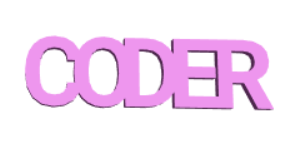

## Ένωση των γραμμάτων

Στη συνέχεια, θα ενώσεις τα γράμματα μαζί έτσι ώστε το μπρελόκ να μοιάζει με αυτό:

--- task ---

Άλλαξε τον κώδικά σου έτσι ώστε να δημιουργεί μόνο το γράμμα «C».

--- /task --- --- task ---

Το μπλοκ `union`{:class="blockscadsetops"} ενώνει τα σχήματα. Ξεκίνησε με τα δύο πρώτα γράμματα του «CODER».

Τα μπλοκ διακρίνονται ανάλογα με το χρώμα τους. Κοίταξε κάτω από το `Set Ops`{:class="blockscadsetops"} για να βρεις το `union`{:class="blockscadsetops"}.

Παρατήρησε ότι το μπλοκ `3D Text`{:class="blockscad3dshapes"} βρίσκεται κάτω από το `Text`{:class="blockscadstext"}, ακόμη κι αν είναι πράσινο.

--- /task --- --- task ---

Κάνε κλικ στο **Render** και θα δεις ότι υπάρχει ένα πρόβλημα: τα «C» και τα «O» βρίσκονται στο ίδιο σημείο.

Πρέπει να μετακινήσεις το "O" κατά μήκος του άξονα X έτσι ώστε να βρίσκεται μετά το "C".

--- /task --- --- task ---

Πρόσθεσε ένα μπλοκ `translate`{:class="blockscadtransforms"} και θέσε την τιμή του `X` σε `10` ώστε να μετακινήσεις το "O" 10 χιλιοστά κατά μήκος του άξονα X.

Τώρα τα γράμματα θα ακουμπάνε το ένα το άλλο, αλλά δεν θα βρίσκονται στο ίδιο σημείο.

--- /task --- --- task ---

Κάντε κλικ στο κουμπί `[+]` στο μπλοκ `union`{:class="blockscadsetops"} για να προσθέσεις κενό για ακόμη ένα μπλοκ.

--- /task --- --- task ---

Κάνε δεξί κλικ στο μπλοκ `translate`{:class="blockscadtransforms"} και επίλεξε **Duplicate** για να δημιουργήσεις ένα αντίγραφο.

--- /task --- --- task ---

Σύρε το αντίγραφο στο μπλοκ `union`{:class="blockscadsetops"} και άλλαξε το 'O' σε 'D'.

--- /task --- --- task ---

Άλλαξε την τιμή `X` του δεύτερου μπλοκ `translate`{:class="blockscadtransforms"} έτσι ώστε το "D" να είναι στη σωστή θέση.

--- hints ---
 --- hint ---

Σκέψου τι άλλαξες για να μετακινήσεις το "O" μετά το "C". Το "D" ξεκινάει στο ίδιο σημείο με το "C" και πρέπει να το μετακινήσεις μετά το "O".

--- /hint --- --- hint ---

    

--- /hint ------ /hints ---

--- /task --- --- task ---

Τώρα, πρόσθεσε ένα «E» και ένα «R» για να ολοκληρώσεις τη λέξη «CODER».

Βεβαιώσου ότι όλα τα γράμματα αγγίζουν το ένα το άλλο και ότι δεν υπάρχουν κενά μεταξύ τους.

--- hints ---
 --- hint ---

Κάντε κλικ στο κουμπί `+` στο μπλοκ `union`{:class="blockscadsetops"} για να προσθέσεις κενό για ακόμη δύο γράμματα.

--- /hint --- --- hint ---

Μπορείς να αντιγράψεις τον κώδικα που χρησιμοποίησες για να δημιουργήσεις το «D» και μετά να αλλάξεις τα γράμματα και τις τιμές του `X`.

--- /hint --- --- hint ---

    

--- /hint ------ /hints ---

--- /task --- --- task ---

Κοίταξε προσεκτικά - είναι τα "E" και "R" ενωμένα; Εάν δεν είναι, πρέπει να προσαρμόσεις τον κώδικά σου.

--- /task ---

