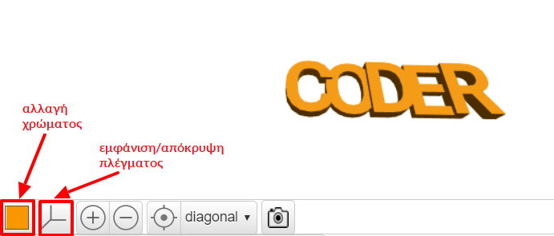

## Αλλαγή πάχους

Στη συνέχεια, τροποποίησε το πάχος των γραμμάτων για να τα διαχωρίσεις και για να κάνεις το μπρελόκ σου ακόμη καλύτερο.

--- task ---

Τα γράμματα έχουν αυτή τη στιγμή πάχος 2 χιλιοστά.

Άλλαξε το πάχος των "C", "D" και "R" έτσι ώστε να έχουν πάχος 3 χιλιοστά.

--- hints ---
 --- hint ---

Άλλαξε την τιμή `thickness` για το κείμενο.

--- /hint --- --- hint ---

Άλλαξε την τιμή `thickness` για τα "C", "D" και "R" σε `3` έτσι ώστε να είναι παχύτερα από τα «O» και «E».

--- /hint ------ /hints ---

--- /task ---   
--- task ---

Μπορείς να κάνεις κλικ στο έγχρωμο τετράγωνο για να αλλάξεις το χρώμα του μοντέλου σου στην προβολή εξόδου. Εάν εκτυπώσεις σε 3D το μοντέλο, το χρώμα του μπρελόκ θα εξαρτηθεί από το χρώμα του πλαστικού νήματος που χρησιμοποιείς, αλλά είναι χρήσιμο να δοκιμάσεις διαφορετικά χρώματα στην προβολή εξόδου.

Μπορείς επίσης να εμφανίσεις και να αποκρύψεις το πλέγμα. Δοκίμασε και τα υπόλοιπα κουμπιά και δες τι κάνουν.

Μπορείς να σύρεις το μοντέλο σου για να το δεις και από διαφορετικές οπτικές γωνίες.

--- /task ---
