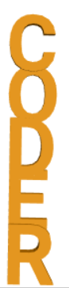

## Πρόκληση: Δημιούργησε ένα μπρελόκ με το όνομά σου

Τώρα, δημιούργησε έναν μπρελόκ ή σήμα 3D με το όνομά σου ή άλλη λέξη ή σύντομη φράση.

Συμβουλές:
+ Βεβαιώσου ότι όλα τα γράμματα ενώνονται
+ Βεβαιώσου ότι το πίσω μέρος του μπρελόκ είναι επίπεδο και ομοιόμορφο, διαφορετικά θα είναι πολύ δύσκολο να εκτυπωθεί

Ακολουθεί ένα παράδειγμα:

## Πρόκληση: Δημιούργησε ένα μπρελόκ με κάθετα γράμματα

Δημιούργησε ένα μπρελόκ όπου τα γράμματα κατευθύνονται κάθετα αντί για οριζόντια.

Ακολουθεί ένα παράδειγμα:

--- hints ---
 --- hint ---

Αυτή τη φορά, θα πρέπει να χρησιμοποιήσεις το μπλοκ `translate` για τα γράμματα κατά μήκος του άξονα Υ.

--- /hint ------ /hints ---

## Πρόκληση: πρόσθεσε ένα κρίκο

Εάν δεν υπάρχει πουθενά κάποιο σημείο στην αρχή της λέξης για να συνδέσεις το δαχτυλίδι του μπρελόκ, τότε θα μπορούσες να προσθέσεις ένα μικρότερο γράμμα «o» για να κάνεις ένα κρίκο.

Ακολουθεί ένα παράδειγμα:

--- hints ---
 --- hint ---

Αυτή τη φορά, θα πρέπει να χρησιμοποιήσεις το μπλοκ `translate` για τα γράμμα "o" κατά μήκος και του άξονα X και του άξονα Υ.

--- /hint ------ /hints ---

