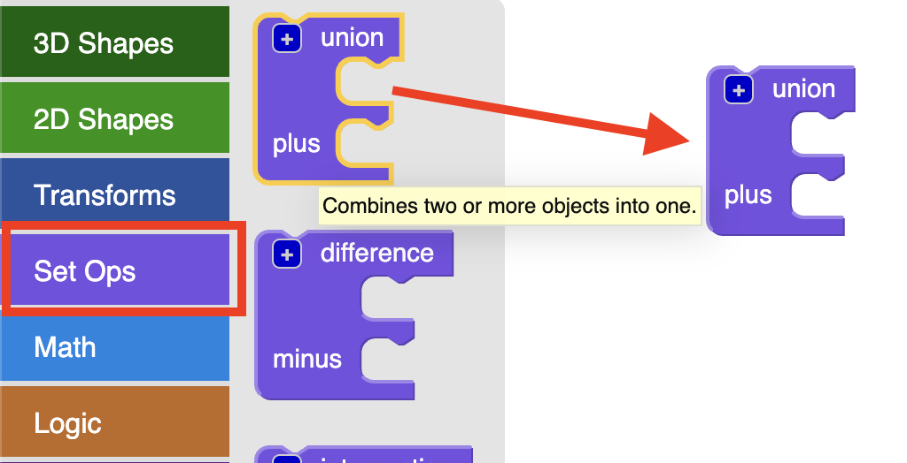

## Creating 3D text

+ Open the BlocksCAD editor in a web browser [blockscad3d.com/editor/](https://www.blockscad3d.com/editor/){:target="_blank"}.

You can drag and drop blocks to write code to create 3D objects. 

Let's start with creating some 3D letters using the 3D text tool.

+ Click on `Text` and then drag a `3D Text` block onto the canvas. 
	
	
	
+ Change the 3D text input to say "CODER"

	
	
+ Now click `Render` to see what it looks like.

	 
	
	Rendering is the process of creating an image from a 3D model so that we can see what it looks like. 

+ Let's make the letters bigger. Change the size to 20 - that means font size 20. 
	
	 
	
	You can click `Render` again to see the result. 
	
If you 3D printed the model you have created now then you would get five separate letters because they are not joined together. That wouldn't make a very good keyring!

	

	
	

 