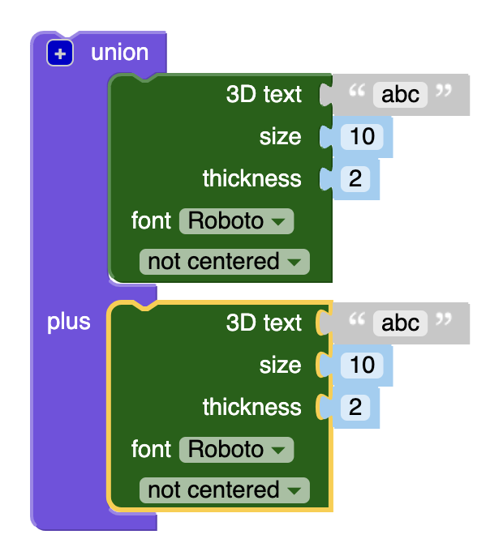
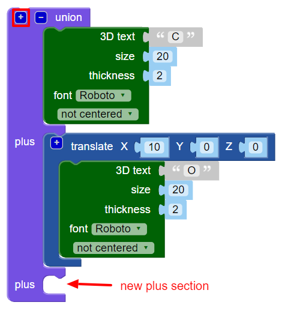

## Create 3D text

 

--- task ---

Open the BlocksCAD editor in a web browser [blockscad3d.com/editor/](https://www.blockscad3d.com/editor/){:target="_blank"}.

--- /task ---

--- task ---
Click on `Set Ops`{:class="blockscadsetops"} and drag a `union`{:class="blockscadsetops"} block onto the canvas. 

--- /task ---

The `union`{:class="blockscadsetops"} block joins shapes together. 

Start with the first two letters of 'CODER'. 

--- task ---

Click on `Text`{:class="blockscadtext"} and then drag **two** `3D Text`{:class="blockscadtext"} blocks inside the `union`{:class="blockscadsetops"} block.

 

--- /task ---

--- task ---

Change the 3D text value (`abc`) on the first to `C`, then change the second block's 3D text value to `O`.

To make the letters bigger, change the `size` to `20`.

 

--- /task ---

--- task ---	

Click **Render**.

There is a problem: the 'C' and the 'O' are in the same place. 

--- /task ---

You need to move the 'O' along the X axis so that it comes after the 'C'. 

--- task ---	

Add a `translate`{:class="blockscadtransforms"} block and set the value of `X` to `10` to move the 'O' 10mm along the X axis. 

Click **Render** again.	

 
	
Now, the letters should be touching, but not on top of each other. 

--- /task ---

--- task ---	

Click the `[+]` button on the `union`{:class="blockscadsetops"} block to add a space for another block. 

 

--- /task ---
--- task ---

Right-click on the `translate`{:class="blockscadtransforms"} block and select **Duplicate** to create a copy. 

 
	
--- /task ---
--- task ---

Drag the copy into the `union`{:class="blockscadsetops"} block and change the 'O' to a 'D'.
	
 

--- /task ---
--- task ---

Change the `X` value of the second `translate`{:class="blockscadtransforms"} block to `20`, (so that the 'D' is 10mm from the 'O'). 

 
  
--- /task ---

--- task ---

Now, add an 'E' and an 'R' to finish the word 'CODER'. 

Make sure that all of the letters are touching, and that there are no gaps between any of the letters.

You need to click the `+` on the `union`{:class="blockscadsetops"} block to add two more `3D Text`{:class="blockscadtext"} blocks.

You can duplicate the code you used to create a 'D' and then change the letters and the `X` values. 

 
  

--- /task ---

--- task ---

Look closely — are the 'E' and 'R' joined together? If they are not, you need to adjust your code.

--- /task ---

