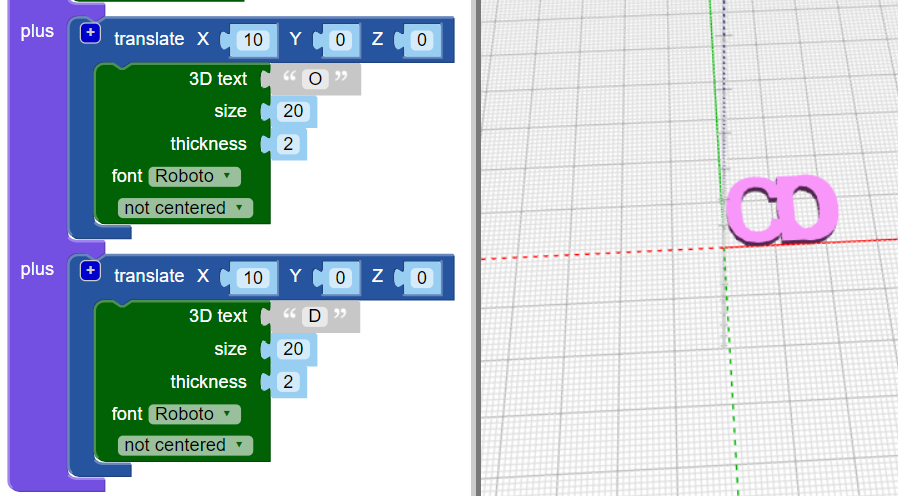

## Joining letters together

Next you're going to join the letters together so that the keyring looks like this:

 

--- task ---
Change your code so that it only creates the letter "C"

 

--- /task ---
--- task ---
The `union`{:class="blockscadsetops"} block joins shapes together. Let's start with the first two letters of "CODER". 

 
	
Blocks are colour-coded, look under `Set Ops` to find `union`{:class="blockscadsetops"}. 
	
Note that the `3D Text` block is found under `Text` even though it's green. 

--- /task ---
--- task ---	
Click `Render` and you'll see that we have a problem. The "C" and the "O" are in the same place. 

		
You need to move the "0" along the X axis so that it comes after the "C". 

--- /task ---
--- task ---	
Add a `translate`{:class="blockscadtransforms"} block to move the "O" 10mm in the X direction. 
	
 
	
Now the letters should be touching but not on top of each other. 

--- /task ---
--- task ---	
Click on the `[+]` image on the `union`{:class="blockscadsetops"} block to add a space for another block. 

--- /task ---
--- task ---
Right-click on the `translate`{:class="blockscadtransforms"} block and choose `duplicate` to create a copy. 

 
	
--- /task ---
--- task ---
Drag the copy into the `union`{:class="blockscadsetops"} block and change the "O" to a "D".
	
 

--- /task ---
--- task ---
Change the X value of the second `translate`{:class="blockscadtransforms"} block so that the D is in the right place. 

--- hints ---
--- hint ---
Think about what you changed to make the "O" move along. The "D" starts off in the same place as the C and you need to move it after the "O". 
--- /hint ---
--- hint ---
	 
--- /hint ---
--- /hints ---

--- /task ---
--- task ---
Now add an "E" and an "R" to finish the word "CODER". 

Take care that all the letters are touching, don't leave a gap between the E and the R.

--- hints ---
--- hint ---
You'll need to click the `+` on the `union`{:class="blockscadsetops"} block to add space for two more letters. 
--- /hint ---
--- hint ---
You can duplicate the code for creating a "D" and then change the letter and the X value. 
--- /hint ---
--- hint ---
	 
--- /hint ---
--- /hints ---

--- /task ---
--- task ---
Look closely, are the E and R joined together? If not, you will need to adjust your code. 
--- /task ---

