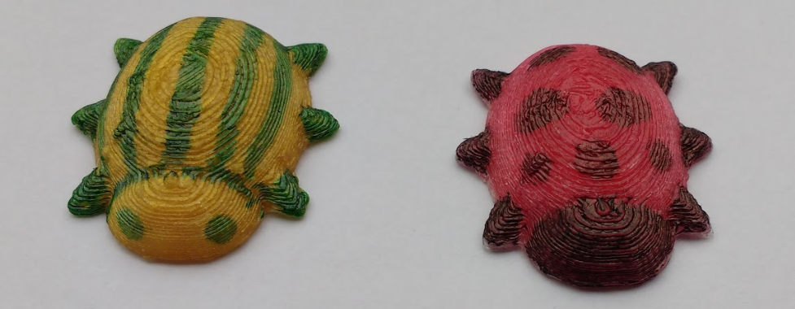

## What can you do now?

If you want to have more fun exploring BlocksCAD and 3D printing, then you could try out any of [these projects](https://projects.raspberrypi.org/en/projects?software%5B%5D=blockscad).

You could create:

 

