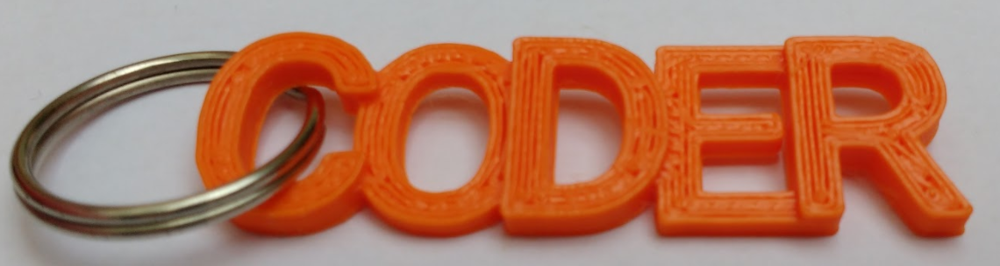

## Introducción

En este proyecto, utilizarás BlocksCAD para diseñar un llavero con las letras 'CODER' que se pueda imprimir en 3D.

BlocksCAD es un editor de modelos en 3D que se puede usar en un navegador web, en una computadora o en una tableta. Arrastras y sueltas bloques de código para diseñar modelos 3D que se pueden exportar para la impresión en 3D.

Si tienes acceso a una impresora 3D, podrás imprimir el llavero. Este no usa mucho filamento de impresión y es pequeño y rápido de imprimir en 3D.

### Lo que harás

El llavero terminado tiene este aspecto:

 

Puedes colocar una anilla partida a través del espacio entre la 'C' y la 'O' para hacer un llavero.

El llavero medirá alrededor de 14 mm por 50 mm.

--- collapse ---
---
title: Lo que necesitarás
---

### Hardware

+ Una impresora 3D y filamento. Los colores sólidos funcionan mejor.
+ Una anilla partida para hacer el llavero. Una de 19 mm de diámetro funciona bien.

### Software

+ Este proyecto se puede completar en un navegador web usando BlocksCAD [blockscad3d.com/editor/](https://www.blockscad3d.com/editor){:target="_blank"}

--- /collapse ---

--- collapse ---
---
title: Lo que vas a aprender
---

+ Cómo crear un objeto 3D sencillo que se pueda imprimir en 3D
+ Cómo trabajar con los ejes X, Y y Z
+ Cómo usar ` trasladar ` para posicionar un objeto 3D

--- /collapse ---

--- collapse ---
---
title: Información adicional para educadores
---

Si necesitas imprimir este proyecto, por favor usa la [versión para imprimir](https://projects.raspberrypi.org/es-ES/projects/blockscad-coder-keyring/print){:target="_blank"}.

Descarga el código del proyecto terminado en [https://rpf.io/p/es-ES/blockscad-coder-keyring-get](https://rpf.io/p/es-ES/blockscad-coder-keyring-get).

--- /collapse ---
