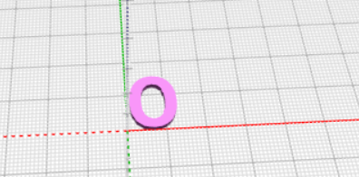
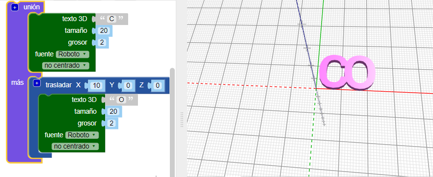
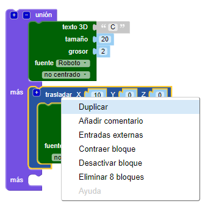

## Pon las letras juntas

A continuación, unirás las letras para que el llavero se vea así:

--- task ---

Cambia el código para que solo aparezca la letra 'C'.

--- /task --- --- task ---

El bloque `unión`{:class="blockscadsetops"} une las formas. Comienza con las dos primeras letras de 'CODER'.

Los bloques están codificados por colores. Mira en `Ops de Conjuntos`{:class="blockscadsetops"} para encontrar el bloque `unión`{:class="blockscadsetops"}.

Ten en cuenta que el bloque `Texto 3D`{:class="blockscad3dshapes"} se encuentra en `Texto`{:class="blockscadstext"}, aunque su color sea verde.

--- /task --- --- task ---

Haz clic en **Hacer** y verás que hay un problema: la 'C' y la 'O' están en el mismo lugar.

Necesitas mover la 'O' a lo largo del eje X para que vaya después de la 'C'.

--- /task --- --- task ---

Añade un bloque `trasladar`{:class="blockscadtransforms"} y establece el valor en el eje `X` a `10` para mover la 'O' 10mm a lo largo del eje X.

Ahora, las letras deben estar juntas, pero no una encima de la otra.

--- /task --- --- task ---

Haz clic en el botón `[+]` del bloque `unión`{:class="blockscadsetops"} para añadir espacio para otro bloque.

--- /task --- --- task ---

Haz clic en el botón derecho del ratón sobre el bloque `trasladar`{: class = "blockscadtransforms"} y selecciona ** Duplicar ** para crear una copia.

--- /task --- --- task ---

Arrastra la copia al bloque `unión`{:class="blockscadsetops"} y cambia la 'O' a una 'D'.

--- /task --- --- task ---

Cambia el valor de `X` del segundo bloque `trasladar`{:class="blockscadtransforms"} para que la 'D' esté en el lugar correcto.

--- hints ---
 --- hint ---

Piensa en lo que cambiaste para que la 'O' se moviera después de la 'C'. La 'D' comienza en el mismo lugar que la 'C', y debes moverla después de la 'O'.

--- /hint --- --- hint ---

    

--- /hint ------ /hints ---

--- /task --- --- task ---

Ahora, añade una "E" y una "R" para terminar la palabra "CODER".

Asegúrate de que todas las letras se toquen y de que no haya espacios entre ellas.

--- hints ---
 --- hint ---

Debes hacer clic en ` + ` en el bloque `unión`{:class="blockscadsetops"} para añadir sitio para dos letras más.

--- /hint --- --- hint ---

Puedes duplicar el código que usaste para crear una 'D' y luego cambiar las letras y los valores de `X`.

--- /hint --- --- hint ---

    

--- /hint ------ /hints ---

--- /task --- --- task ---

Mira de cerca: ¿Están unidas la 'E' y la 'R'? Si no lo están, debes ajustar tu código.

--- /task ---

