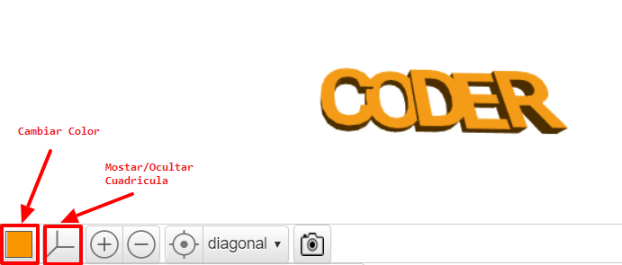

## Cambiar de grosor

A continuación, alternaremos el grosor de las letras para ayudar a separarlas, y mejorar aún más nuestro llavero.

--- task ---

Las letras tienen actualmente 2 mm de grosor.

Cambia el grosor de 'C', 'D' y 'R' para que tengan un grosor de 3 mm.

--- hints --- --- hint ---

Cambiar el valor de `grosor` para el texto.

--- /hint --- --- hint ---

Cambia el valor de `grosor` en 'C', 'D', y 'R' a `3` para que sean más gruesos que 'O' y 'E'.

--- /hint --- --- /hints ---

--- /task ---   
--- task ---

Puedes hacer clic en el cuadrado coloreado para cambiar el color del modelo en la vista de salida. Si imprimes en 3D el modelo, el color del llavero dependerá del color del filamento de plástico que utilices, pero es útil poder probar diferentes colores en la vista de salida.

También puedes mostrar y ocultar la cuadrícula. Prueba los otros botones y mira lo que hacen.

También puedes arrastrar tu modelo para verlo desde diferentes ángulos.

--- /task ---
