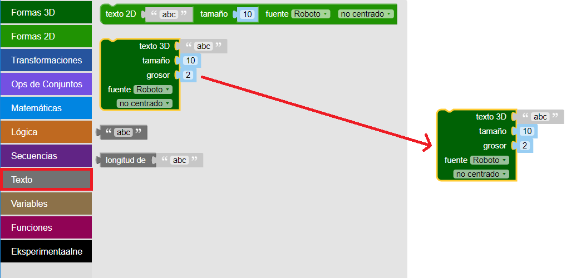

## Crea texto en 3D

--- task ---

Abre el editor BlocksCAD en un navegador web [blockscad3d.com/editor/](https://www.blockscad3d.com/editor/){:target="_blank"}.

Puedes arrastrar y soltar bloques para escribir código que cree objetos en 3D.

--- /task ---

Primero, utiliza la herramienta de texto 3D para crear algunas letras en 3D.

--- task ---

Haz clic en `Texto`{:class="blockscadtext"} y luego arrastra un bloque `Texto 3D`{:class="blockscadtext"} sobre el lienzo.

--- /task --- --- task ---

Cambia la entrada de ` texto 3D ` para que ponga 'CODER'.

--- /task --- --- task ---

Haz clic en el botón **Hacer** para ver el resultado.

El Renderizado (nota: lo que has hecho al pulsar el botón hacer) es el proceso de crear una imagen a partir de un modelo 3D para que podamos ver cómo se ve.

--- /task --- --- task ---

Para agrandar las letras, cambia el `tamaño` hasta `20` - eso significa tamaño de fuente de 20.

Haz clic en **Hacer** de nuevo para ver el resultado.

--- /task ---

Si imprimes en 3D el modelo que has creado ahora, obtendríamos cinco letras separadas, porque no están unidas. ¡Eso no sería un muy buen llavero!

	

	
	

 
