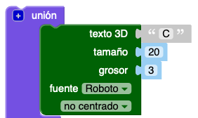
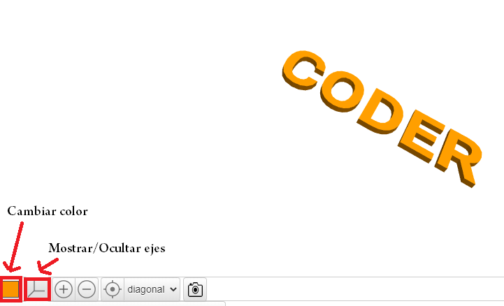

## Cambia el grosor

A continuación, alternaremos el grosor de las letras para ayudar a separarlas, y mejorar aún más nuestro llavero.

--- task ---

Las letras tienen actualmente 2 mm de grosor.

Change the thickness of the 'C', 'D',  and 'R' so that they are 3mm thick.

--- hints --- --- hint ---

Change the `thickness` value for the text.

--- /hint --- --- hint ---

Change the `thickness` value for the 'C', 'D', and 'R' to `3` so that they are thicker than the 'O' and 'E'.

--- /hint --- --- /hints ---

--- /task ---   
--- task ---

You can click on the coloured square to change the colour of your model in the output view. If you 3D print the model, then the colour of the key ring will depend on the colour of the plastic filament that you use, but it's useful to be able to try out different colours in the output view.

You can also show and hide the grid. Try the other buttons and see what they do.

You can drag your model around to view it from different angles too.

--- /task ---
