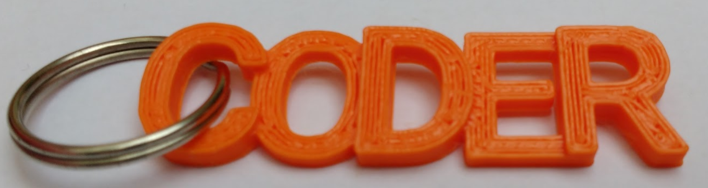

## Ce que tu réaliseras

Design a 'CODER' key ring that can be 3D printed.

BlocksCAD est un éditeur de modèle 3D que tu peux utiliser dans un navigateur Web sur un ordinateur de bureau ou une tablette. Tu fais glisser et déposer des blocs de code pour concevoir des modèles 3D qui peuvent être exportés pour l'impression 3D.

Le porte-clés mesurera environ 14 mm par 50 mm.

### You will need (optional)

+ Une imprimante 3D et du filament. Les couleurs unies fonctionnent mieux. Le porte-clés n'utilise pas beaucoup de filament et est petit et rapide à imprimer en 3D.
+ Un anneau fendu pour faire le porte-clés. Un anneau fendu de 19 mm de diamètre convient bien.
