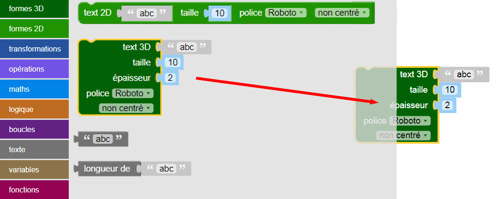
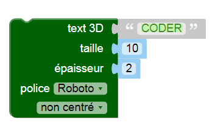
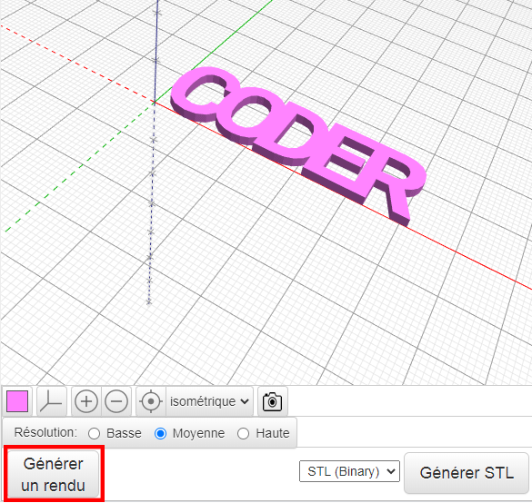
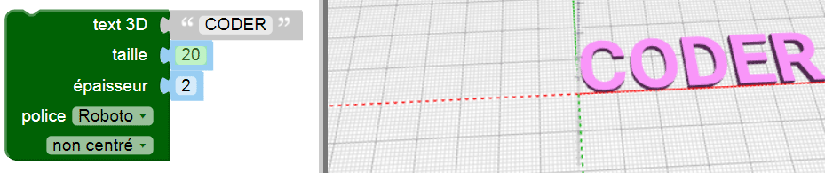

## Crée un texte 3D

--- task ---

Ouvre l'éditeur BlocksCAD dans un navigateur web [blockscad3d.com/editor/](https://www.blockscad3d.com/editor/){:target="_blank"}.

Tu peux faire glisser et déposer des blocs pour écrire du code pour créer des objets 3D.

--- /task ---

Tout d'abord, utilise l'outil de texte 3D pour créer des lettres 3D.

--- task ---

Clique sur `texte`{:class="blockscadtext"} puis fais glisser un bloc `text 3D`{:class="blockscadtext"} sur le canevas.

--- /task --- --- task ---

Modifie l'entrée `text 3D` pour mettre le mot « CODER ».

--- /task --- --- task ---

Clique sur le bouton **Générer un rendu** pour voir à quoi il ressemble.

La génération de rendu est le processus de création d'une image à partir d'un modèle 3D pour que nous puissions voir à quoi il ressemble.

--- /task --- --- task ---

Pour agrandir les lettres, change la `taille` en `20` — cela signifie taille de police 20.

Clique à nouveau sur **Générer un rendu** pour voir le résultat.

--- /task ---

Si tu as imprimé en 3D le modèle que tu as créé maintenant, tu obtiendras cinq lettres séparées, car elles ne sont pas reliées ensemble. Cela ne ferait pas un très bon porte-clés !

	

	
	

 
