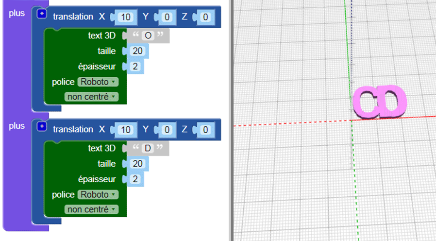

## Relie les lettres ensemble

Ensuite, tu relieras les lettres ensemble pour que le porte-clés ressemble à ceci :

--- task ---

Modifie ton code pour qu'il ne crée que la lettre « C ».

--- /task --- --- task ---

Le bloc `union`{:class="blockscadsetops"} relie les formes ensemble. Commence par les deux premières lettres de « CODER ».

Les blocs sont codés par couleur. Regarde sous `opérations`{:class="blockscadsetops"} pour trouver `union`{:class="blockscadsetops"}.

Note que le bloc `text 3D`{:class="blockscad3dshapes"} se trouve sous `texte`{:class="blockscadstext"}, même s'il est vert.

--- /task --- --- task ---

Clique sur **Générer un rendu** et tu verras qu'il y a un problème : le « C » et le « O » sont au même endroit.

Tu dois déplacer le « O » le long de l'axe X pour qu'il vienne contre le « C ».

--- /task --- --- task ---

Ajoute un bloc `translation`{:class="blockscadtransforms"} et définis la valeur de `X` à `10` pour déplacer le « O » de 10 mm le long de l'axe X.

Maintenant, les lettres devraient se toucher, mais pas être l'une sur l'autre.

--- /task --- --- task ---

Clique sur le bouton `[+]` sur le bloc `union`{:class="blockscadsetops"} pour ajouter un espace pour un autre bloc.

--- /task --- --- task ---

Fais un clic droit sur le bloc `translation`{:class="blockscadtransforms"} et sélectionne **Dupliquer** pour créer une copie.

--- /task --- --- task ---

Fais glisser la copie dans le bloc `union`{:class="blockscadsetops"} et change le « O » en « D ».

--- /task --- --- task ---

Change la valeur `X` du deuxième bloc `translation`{:class="blockscadtransforms"} pour que le « D » soit au bon endroit.

--- hints --- --- hint ---

Pense à ce que tu as changé pour faire bouger le « O » après le « C ». Le « D » commence au même endroit que le « C » et tu dois le déplacer après le « O ».

--- /hint --- --- hint ---

    

--- /hint --- --- /hints ---

--- /task --- --- task ---

Maintenant, ajoute un « E » et un « R » pour terminer le mot « CODER ».

Assure-toi que toutes les lettres se touchent et qu'il n'y a aucun espace entre les lettres.

--- hints --- --- hint ---

Tu dois cliquer sur le bloc `+` sur `union`{:class="blockscadsetops"} pour ajouter de l'espace pour deux lettres supplémentaires.

--- /hint --- --- hint ---

Tu peux dupliquer le code que tu as utilisé pour créer un « D » et ensuite changer les lettres et les valeurs `X`.

--- /hint --- --- hint ---

    

--- /hint --- --- /hints ---

--- /task --- --- task ---

Regarde de plus près — est-ce que les « E » et « R » se touchent ? S'ils ne se touchent pas, tu dois ajuster ton code.

--- /task ---

