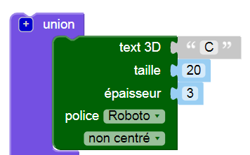
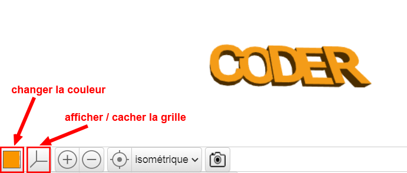

## Change l'épaisseur

Ensuite, alterne l'épaisseur des lettres pour aider à les séparer et améliorer ton porte-clés.

--- task ---

Les lettres ont actuellement 2 mm d'épaisseur.

Change l'épaisseur du « C », du « D » et du « R » pour qu'ils aient 3 mm d'épaisseur.

--- hints --- --- hint ---

Modifie la valeur `épaisseur` pour le texte.

--- /hint --- --- hint ---

Mets la valeur `épaisseur` pour le « C », le « D » et le « R » à `3` afin qu'ils soient plus épais que le « O » et « E ».

--- /hint --- --- /hints ---

--- /task ---   
--- task ---

Tu peux cliquer sur le carré coloré pour changer la couleur de ton modèle dans la vue de sortie. Si tu imprimes le modèle en 3D, la couleur du porte-clés dépendra de la couleur du filament plastique que tu utilises, mais il est utile de pouvoir essayer différentes couleurs dans la vue de sortie.

Tu peux également afficher et masquer la grille. Essaie les autres boutons et vois ce qu'ils font.

Tu peux également faire tourner ton modèle pour le voir sous différents angles.

--- /task ---
