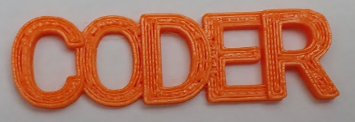

## Imprime ton porte-clés en 3D

BlocksCAD peut exporter un fichier `.STL` pour l'impression 3D.

--- task ---

Fais un rendu de ton modèle, puis clique sur **Générer STL**. Souviens-toi où tu enregistres le fichier STL.

--- /task --- --- task ---

Il existe de nombreux outils qui peuvent lire des fichiers STL et envoyer des modèles 3D à une imprimante.

Celui que tu choisis dépendra de l'imprimante 3D que tu utilises.

--- /task --- --- task ---

Retire très soigneusement l'impression 3D du plateau.

--- /task --- --- task ---

Tu devras peut-être enlever quelques petits brins de filament pour nettoyer l’impression.

--- /task ---

