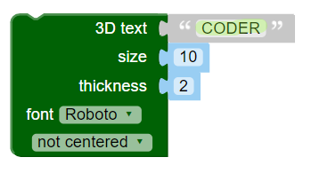
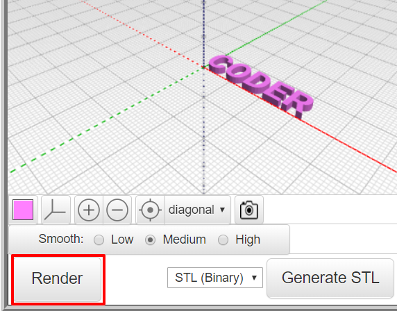

## 3D टेक्स्ट बनाये

--- task ---

BlocksCAD को वेब ब्राउज़र में खोलें [blockscad3d.com/editor/](https://www.blockscad3d.com/editor/){:target="_blank"}.

3D ऑब्जेक्ट बनाने के लिए कोड लिखने के लिए आप ब्लॉक को ड्रैग और ड्रॉप कर सकते हैं।

--- /task ---

सबसे पहले, कुछ 3D अक्षर बनाने के लिए 3D टेक्स्ट टूल का उपयोग करें।

--- task ---

पहले `Text`{:class="blockcadtext"} पर क्लिक करे और फिर `3D Text`{:class="blockscadtext"} ब्लॉक को कैनवास पर खींच कर लायें ।

--- /task --- --- task ---

`3D Text` इनपुट को 'CODER' कहने के लिए बदले।

--- /task --- --- task ---

परिणाम देखने के लिए **Render** बटन पर क्लिक करें।

Rendering (रेंडरिंग) एक 3D मॉडल से एक छवि बनाने की प्रक्रिया है ताकि हम देख सकें कि यह कैसा दिखता है।

--- /task --- --- task ---

अक्षरों को बड़ा करने के लिए, `size` को `20` में बदले - इसका मतलब है कि अब फॉन्ट साइज 20 है ।

परिणाम देखने के लिए **Render** बटन पर क्लिक करें।

--- /task ---

यदि आपने अभी बनाए गए मॉडल को 3D प्रिंट किया, तो आपको पांच अलग-अलग अक्षर मिलेंगे, क्योंकि वे एक साथ जोड़े नहीं गये हैं। यह एक बहुत अच्छी चाबी का छल्ला नहीं होगी!

	

	
	

 
