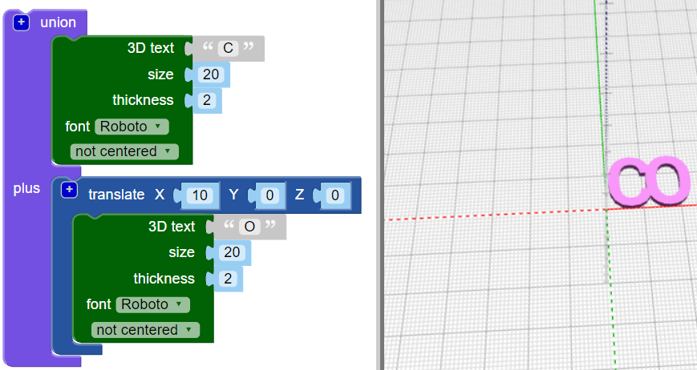
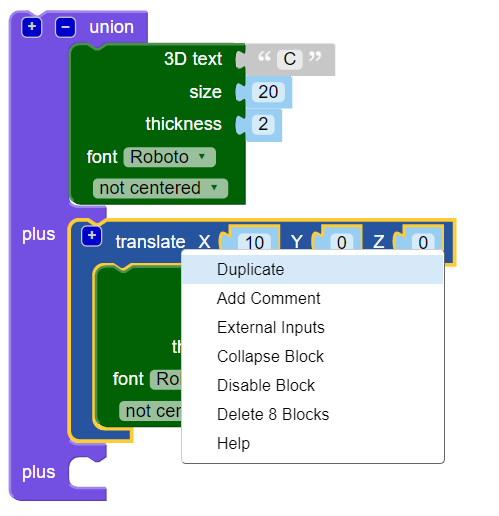
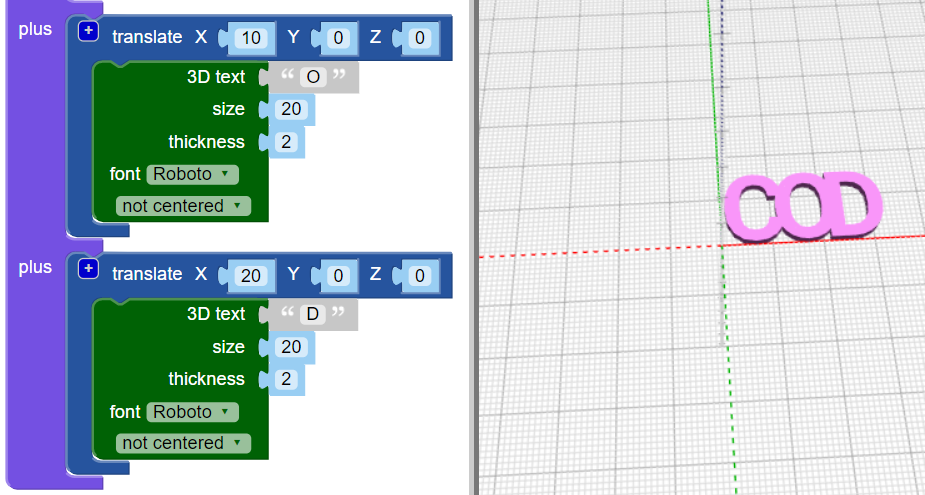

## अक्षरों को साथ जोड़े

इसके बाद, आप अक्षरों को एक साथ जोड़ देंगे ताकि चाबी का छल्ला इस तरह दिखे:

--- task ---

अपना कोड बदलें ताकि यह केवल 'C' अक्षर का निर्माण करे।

--- /task --- --- task ---

`union`{:class="blockcadsetops"} ब्लॉक आकृतियों को एक साथ जोड़ता है। ‘CODER’ के पहले दो अक्षरों से शुरू करें।

ब्लॉक कलर-कोडेड हैं। `Set Ops`{:class="blockcadsetops"} के नीचे `union`{:class="blockscadsetops"} को खोजे।

ध्यान दें कि `3D Text`{:class="blockcad3dshapes"} ब्लॉक `Text`{:class="blockcadstext"} के नीचे ही मिलेगा, भले ही वह हरा हो।

--- /task --- --- task ---

**Render** पर क्लिक करें और आप देखेंगे कि एक समस्या है: 'C' और 'O' एक ही स्थान पर हैं।

आपको ‘O’ को X-axis(अक्ष) के साथ स्थानांतरित करने की आवश्यकता है ताकि वह 'C’ के बाद आए।

--- /task --- --- task ---

एक `translate`{:class="blockscadtransforms"} ब्लॉक जोड़ें और `X` के मान को `10` पर सेट करे जिससे 'O' को X-Axis के साथ 10mm स्थानांतरित कर सके।

अब, अक्षरों को आपस में स्पर्श करना चाहिए, लेकिन एक दूसरे के ऊपर नही होने चाहिए ।

--- /task --- --- task ---

एक और ब्लॉक के लिए जगह बनाने के लिए `union`{:class="blockcadsetops"} ब्लॉक पर मौजूद `[+]` पर क्लिक करे।

--- /task --- --- task ---

एक और प्रति बनाने के लिए `translate`{:class="blockscadtransforms"} ब्लॉक पर राइट-क्लिक करें और **Duplicate** को चुने ।

--- /task --- --- task ---

कॉपी को `union`{:class="blockscadsetops"} ब्लॉक मे खींचे और 'O' को 'D' में बदलें।

--- /task --- --- task ---

दूसरे `translate`{:class="blockscadtransforms"} ब्लॉक मे `X` के मान(value) को बदले ताकि 'D' सही जगह पर आ जाए।

--- hints ---
 --- hint ---

इस बारे में सोचें कि आपने ‘O’ को 'C’ के बाद पहुँचाने के लिए क्या बदला। 'D' उसी स्थान से शुरू होता है जहाँ से 'C', और आपको इसे 'O' के बाद ले जाने है।

--- /hint --- --- hint ---

--- /hint ------ /hints ---

--- /task --- --- task ---

अब 'CODER' शब्द को समाप्त करने के लिए 'E' और 'R' जोड़ें।

यह सुनिश्चित करें कि सभी letters आपस में स्पर्श कर रहे हैं और अक्षरों के बीच कोई जगह नहीं है।

--- hints ---
 --- hint ---

दो और अक्षरों की जगह बनाने के लिए `union`{:class="blockscadsetops"} ब्लॉक पर मौजूद `[+]` पर क्लिक करे।

--- /hint --- --- hint ---

आप उस कोड को दोबारा प्रयोग कर सकते हैं जिसका उपयोग आपने 'D' बनाने के लिए किया था, पर अक्षरों और `X` की मान(value) को बदले।

--- /hint --- --- hint ---

--- /hint ------ /hints ---

--- /task --- --- task ---

बारीकी से देखें - क्या 'E’ और 'R’ एक साथ जुड़े हुए हैं? यदि वे नहीं हैं, तो आपको अपना कोड ठीक करने की आवश्यकता है।

--- /task ---

