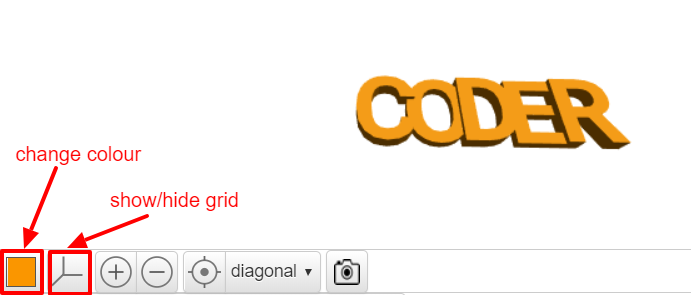

## मोटाई बदलें

इसके बाद, उन्हें अलग करने में मदद करने के लिए अक्षरों की मोटाई को कम ज़्यादा करे और अपनी चाबी के छल्ले को और बेहतर बनाये।

--- task ---

अक्षरें अभी 2mm मोटे हैं।

'C', 'D', और 'R' की मोटाई बदलें ताकि वे 3mm मोटी हों।

--- hints ---
 --- hint ---

टेक्स्ट की `thickness` मूल्य(value) बदले।

--- /hint --- --- hint ---

'C', 'D', और 'R' की `thickness` को `3` मे बदले ताकि वे ‘O’ और 'E’ से अधिक मोटे हों।

--- /hint ------ /hints ---

--- /task ---   
--- task ---

आउटपुट दृश्य (view) में अपने मॉडल का रंग बदलने के लिए आप रंगीन वर्ग (square) पर क्लिक कर सकते हैं। यदि आप मॉडल को 3D प्रिंट करते हैं, तो चाबी के छल्ले का रंग आपके द्वारा उपयोग किए जाने वाले प्लास्टिक फिलामेंट के रंग पर निर्भर करेगा, लेकिन आउटपुट दृश्य में विभिन्न रंगों को आज़माने में सक्षम होना उपयोगी है।

आप ग्रिड को दिखा और छिपा भी सकते हैं। अन्य बटन आज़माएं और देखें कि वे क्या करते हैं।

आप अपने मॉडल को विभिन्न कोणों से भी देखने के लिए चारों ओर खींच सकते हैं।

--- /task ---
