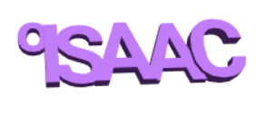

## चुनौती: अपने नाम के साथ एक चाबी का छल्ला बनाएँ

अब, अपने नाम या किसी अन्य शब्द या छोटे वाक्यांश के साथ एक 3D Text या बैज(badge) बनाएं।

सलाह:
+ सुनिश्चित करें कि सभी अक्षरे जुड़े हों
+ सुनिश्चित करें कि आपकी keying का पिछला हिस्सा सपाट और एकसार हो अन्यथा इसे प्रिंट करना बहुत मुश्किल होगा

यहाँ एक उदाहरण है:

## चुनौती: खड़े अक्षरों के साथ एक चाबी का छल्ला बनाएँ

एक चाबी का छल्ला बनाएँ, जहाँ अक्षारें लंबवत (vertically) पंक्तिबद्ध हो, ना कि क्षैतिज रूप से।

यहाँ एक उदाहरण है:

--- hints --- --- hint ---

इस बार आपको अक्षरों को Y अक्ष (axis) के साथ `translate` करना पड़ेगा।

--- /hint --- --- /hints ---

## चुनौती: एक लूप जोड़ें

यदि आपके शब्द की शुरुआत में चाबी का छल्ला जोड़ने के लिए कुछ नहीं है, तो आप लूप बनाने के लिए एक छोटा letter 'O’ जोड़ सकते हैं।

यहाँ एक उदाहरण है:

--- hints --- --- hint ---

इस बार आपको ‘O’ को X अक्ष(axis) और Y अक्ष (axis) के साथ `translate` करना पड़ेगा।

--- /hint --- --- /hints ---

