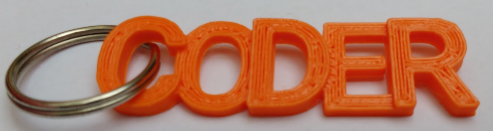

## はじめに

このプロジェクトではBlocksCADを使用して、3Dプリントできる「CODER」(コーダー) キーホルダーを設計 (せっけい) します。

BlocksCADは、コンピューターまたはタブレットのウェブブラウザで使用できる3Dモデルエディターです。 コードブロックをドラッグ&ドロップして、3Dプリント用にエクスポートできる3Dモデルを設計します。

3Dプリンターが使える場合は、キーホルダーを3Dプリントできます。 キーリングはフィラメントをあまり使わず、小さいので速く3Dプリントできます。

### 作るもの

完成 (かんせい) したキーホルダーはこのようになります。

 

「C」と「O」のすきまにダブルリングを入れて、キーホルダーを作ることができます。

キーホルダーの大きさは大体14mm x 50mmです。

--- collapse ---
---
title: 必要 (ひつよう) なもの
---

### ハードウェア

+ 3Dプリンターとフィラメント。 単色 (たんしょく) が向いています。
+ キーホルダー用のダブルリング。 直径 (ちょっけい) 19mm のダブルリングがぴったりです。

### ソフトウェア

+ このプロジェクトは、 BlocksCAD [blockscad3d.com/editor/](https://www.blockscad3d.com/editor){:target="_blank"}を使用してウェブブラウザ上で完成させることができます。

--- /collapse ---

--- collapse ---
---
title: 学ぶこと
---

+ 3Dプリントできるシンプルな3Dオブジェクトを作る方法
+ X、Y、Z軸 (じく) の使い方
+ `移動` (いどう) を使った3Dオブジェクトを配置 (はいち) する方法

--- /collapse ---

--- collapse ---
---
title: 教育者向けの追加情報
---

このプロジェクトを印刷する必要がある場合は、 [印刷用バージョン](https://projects.raspberrypi.org/ja-JP/projects/blockscad-coder-keyring/print){:target="_blank"}を使用してください。

完成したプロジェクトコードは [http://rpf.io/p/ja-JP/blockscad-coder-keyring-get](http://rpf.io/p/ja-JP/blockscad-coder-keyring-get)からダウンロードできます。

--- /collapse ---
