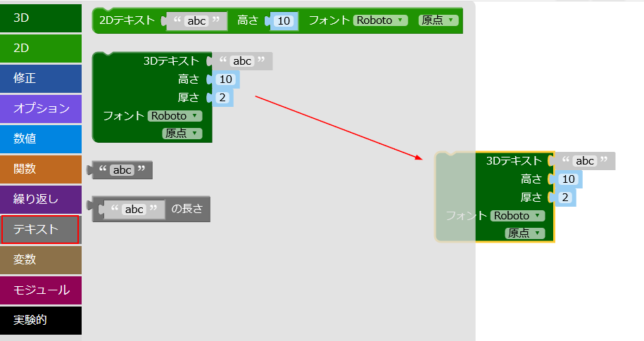
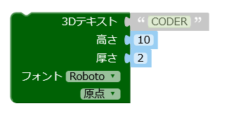
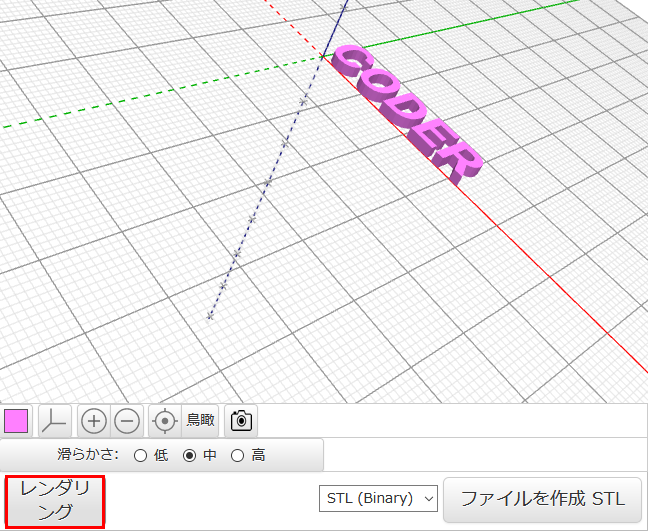
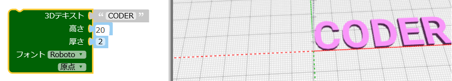

## 3Dテキストを作る

--- task ---

ウェブブラウザでBlocksCADエディターを開きます。 [blockscad3d.com/editor/](https://www.blockscad3d.com/editor/){:target="_blank"}

ブロックをドラッグ&ドロップして、3Dオブジェクトを作成するコードを書くことができます。

--- /task ---

まず、3Dテキストツールを使用して3D文字を作成します。

--- task ---

`テキスト`{:class="blockscadtext"}をクリックし、キャンバスに`3Dテキスト`{:class="blockscadtext"}ブロックをドラッグします。

--- /task --- --- task ---

`3Dテキスト`を「CODER」にします。

--- /task --- --- task ---

**レンダリング**ボタンをクリックして、どのようなものができたか見てみましょう。

レンダリングとは、3Dモデルからイメージを作成し、それがどのように見えるかをかくにんできるようにするプロセスです。

--- /task --- --- task ---

文字を大きくするには、`高さ`を`20`にかえます。これはフォントサイズが20という意味です。

もう一度**レンダリング**をクリックしてみましょう。

--- /task ---

今作成したモデルを3Dプリントすると、つながっていないので5つのバラバラの文字が出てきます。 これでは、あまりいいキーホルダーにはなりませんね！

	

	
	

 
