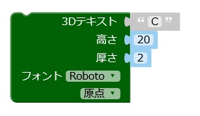
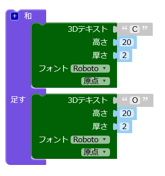
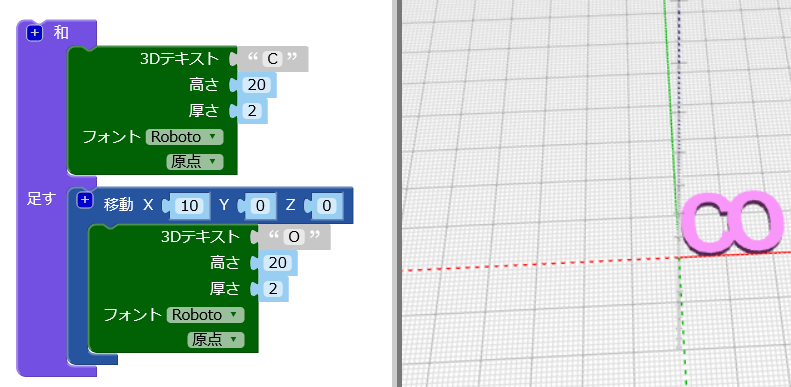
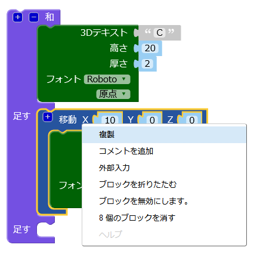
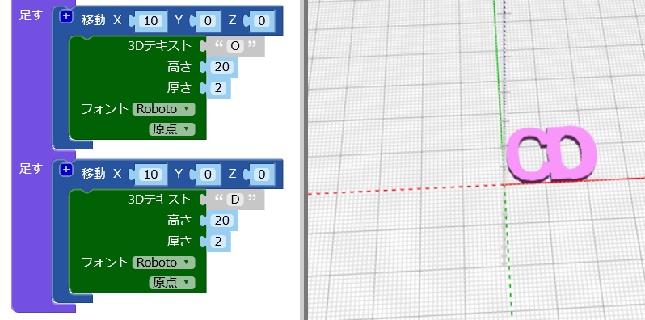
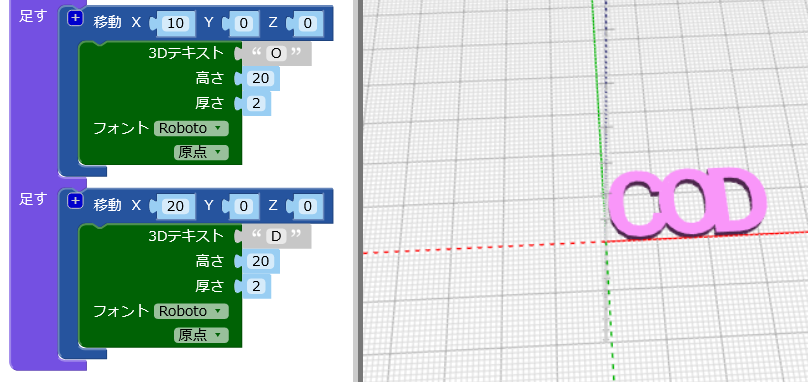
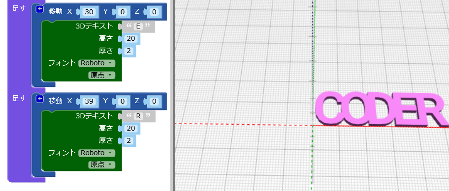

## 文字をつなげる

次に、キーホルダーがこんな感じになるように文字をつなげます。

--- task ---

文字「C」のみを作成するようにコードをかえます。

--- /task --- --- task ---

`和`{:class="blockscadsetops"}ブロックは形をつなぎ合わせるブロックです。 「CODER」のはじめの2文字から始めましょう。

ブロックは色分けされています。 `和`{:class="blockscadsetops"}ブロックは`オプション`{:class="blockscadsetops"}にあります。

`3Dテキスト`{:class="blockscad3dshapes"}ブロックは緑色ですが、`テキスト`{:class="blockscadstext"}にあります。

--- /task --- --- task ---

**レンダリング**をクリックすると、「C」と「O」が同じ場所にあるという問題が見つかります。

「C」の後に来るように、「O」をX軸 (じく) にそって動かす必要があります。

--- /task --- --- task ---

`移動`{:class="blockscadtransforms"} (いどう) ブロックを追加 (ついか) します。`X`の値 (あたい) を`10`にして、「O」をX軸にそって10mm動かします。

これで文字はくっついていますが、重なってはいません。

--- /task --- --- task ---

`和`{:class="blockscadsetops"}ブロックの`[+]`ボタンをクリックして、べつのブロックのスペースを追加します。

--- /task --- --- task ---

`移動`{:class="blockscadtransforms"}ブロックを右クリックし、**複製** (ふくせい) をえらんでブロックのコピーを作ります。

--- /task --- --- task ---

コピーしたブロックを`和`{:class="blockscadsetops"}ブロックにドラッグし、「O」を「D」にかえます。

--- /task --- --- task ---

2つ目の`移動`{:class="blockscadtransforms"}ブロックの`X`の値をかえて、「D」が正しい場所に来るようにします。

--- hints ---
 --- hint ---

「C」の後ろに「O」を移動させるために何をしましたか？ 「D」は始めは「C」と同じ場所にあり、「O」の後ろに移動する必要があります。

--- /hint --- --- hint ---

--- /hint ------ /hints ---

--- /task --- --- task ---

次に、「E」と「R」を追加して「CODER」という単語を完成させます。

すべての文字がすきまなく、くっついていることをたしかめましょう。

--- hints ---
 --- hint ---

`和`{:class="blockscadsetops"}ブロックの`[+]`ボタンをクリックして、2文字分のブロックのスペースを追加します。

--- /hint --- --- hint ---

「D」を作るのに使ったコードを複製し、文字と`X`の値をかえることができます。

--- /hint --- --- hint ---

--- /hint ------ /hints ---

--- /task --- --- task ---

「E」と「R」がくっついているかよく見てみましょう。 くっついていない場合は、コードを調整する必要があります。

--- /task ---

