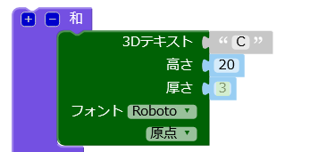
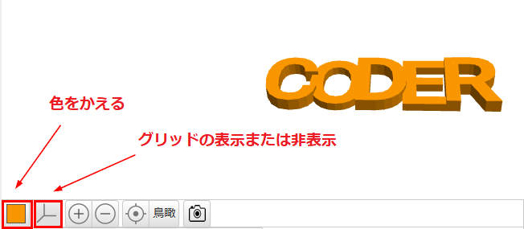

## 厚さ (あつさ) をかえる

文字の太さを1文字ごとにかえると見分けやすくなるので、キーホルダーがもっと良くなります。

--- task ---

今、文字の厚さは2mmです。

「C」、「D」、「R」の厚みを3mmになるようにかえます。

--- hints --- --- hint ---

テキストの`厚さ`の値をかえます。

--- /hint --- --- hint ---

「C」、「D」、「R」の`厚さ`の値を`3`にして、「O」や「E」よりも厚くします。

--- /hint --- --- /hints ---

--- /task ---   
--- task ---

色のついた四角い部分をクリックすると、出力ビューでモデルの色をかえることができます。 If you 3D print the model, then the colour of the key ring will depend on the colour of the plastic filament that you use, but it's useful to be able to try out different colours in the output view.

You can also show and hide the grid. Try the other buttons and see what they do.

You can drag your model around to view it from different angles too.

--- /task ---
