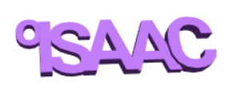

## チャレンジ：自分の名前でキーホルダーを作ろう

自分の名前や他の単語、短いフレーズを使って、3Dテキストキーホルダーまたはバッジを作りましょう。

注意点
+ すべての文字がくっついていることをたしかめましょう。
+ キーホルダーのうらが平らでまっすぐであることをたしかめましょう。そうでないと3Dプリントがとてもむずかしくなってしまいます。

以下に例を示します：

## チャレンジ：たて書きでキーホルダーを作ろう

文字が横ではなくたてにならぶキーホルダーを作りましょう。

以下に例を示します：

--- hints --- --- hint ---

今回は、Y軸にそって文字を`移動`する必要があります。

--- /hint --- --- /hints ---

## チャレンジ：わっかをつける

単語のはじめにダブルリングをつける場所がない場合は、小文字の「o」をわっかとしてくっつけることができます。

以下に例を示します：

--- hints --- --- hint ---

今回は、X軸とY軸にそって「o」を`移動`する必要があります。

--- /hint --- --- /hints ---

