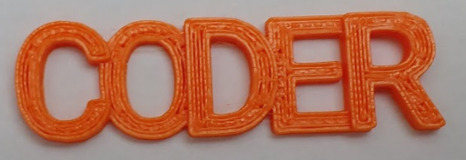

## キーホルダーを3Dプリントする

BlocksCADは3Dプリント用の`.STL`ファイルをエクスポートできます。

--- task ---

モデルをレンダリングし、**ファイルを作成 STL**をクリックします。 STLファイルを保存する場所をおぼえておきましょう。

--- /task --- --- task ---

STLファイルを読みこんで3Dモデルをプリンターに送信できるツールはたくさんあります。

どのツールにするかは使う3Dプリンターによります。

--- /task --- --- task ---

3Dプリントが終わったら、プリントベッドからしんちょうに取りはずします。

--- /task --- --- task ---

小さなバリを取りのぞいて形を整える必要があるかもしれません。

--- /task ---

