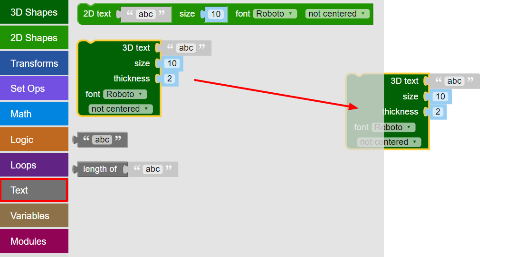
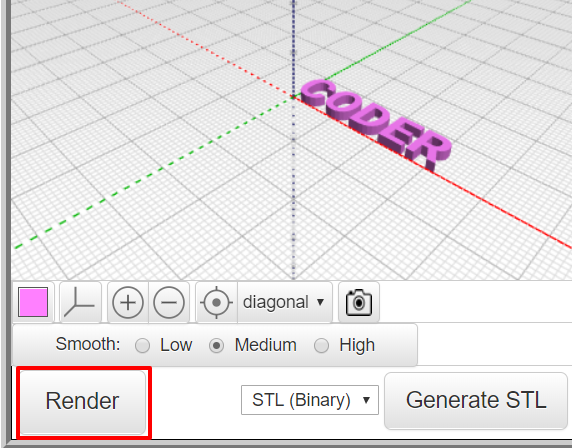

## 3D 텍스트 만들기

--- task ---

웹브라우저에서 BlocksCAD 편집기를 엽니다. [blockscad3d.com/editor/](https://www.blockscad3d.com/editor/){:target="_blank"}.

블록을 드래그 앤 드롭하여 3D 객체 제작을 위한 코드를 작성합니다.

--- /task ---

첫째, 3D 텍스트 툴로 3D 글자 몇개를 만듭니다.

--- task ---

`텍스트`{:class="blockscadtext"}를 클릭 후 `3D 텍스트`{:class="blockscadtext"} 블록을 캔버스 위로 드래그 합니다.

--- /task --- --- task ---

입력된 `3D 텍스트`를 'CODER'로 변경합니다.

--- /task --- --- task ---

**렌더** 버튼을 클릭해 이미지를 확인합니다.

렌더링이란 3D 모델을 이미지로 표현해 객체의 형태가 나타나도록 하는 절차입니다.

--- /task --- --- task ---

폰트 사이즈를 키우기 위해 `사이즈`를 `20`으로 조절해 폰트 사이즈 20이 되도록 합니다.

**렌더** 를 다시 한번 클릭해 결과를 확인합니다.

--- /task ---

현재까지 만든 모델을 3D 프린터로 출력하면 5개 글자가 각각 떨어져 나타나는데 이는 글자가 조합되지 않았기 때문입니다. 그러면 훌륭한 키 링이 될 수 없겠죠!

	

	
	

 
