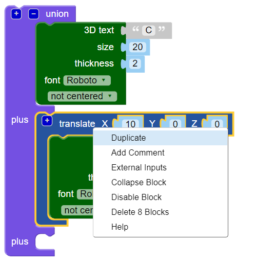
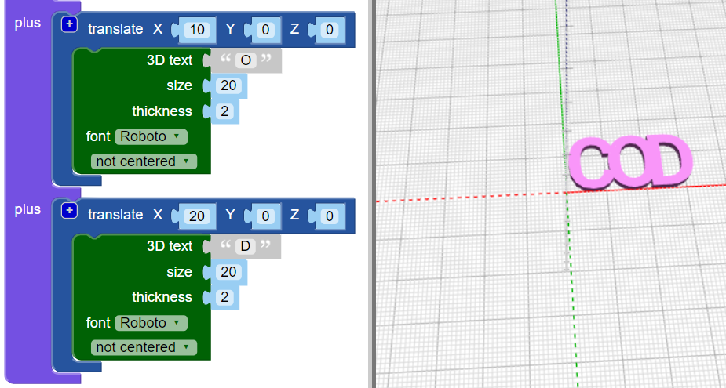

## 글자 결합하기

다음으로, 글자를 서로 결합해 키링이 다음과 같이 보이게 만듭니다:

--- task ---

코드를 변경해 글자 'C'만을 생성합니다.

--- /task --- --- task ---

`union (결합)`{:class="blockscadsetops"} 블록을 통해 형태를 결합합니다. 'CODER'의 첫 두 글자를 시작해 봅니다.

블록엔 코드가 들어있고 색상으로 구분됩니다. `Set Ops (옵션 설정)`{:class="blockscadsetops"} 아래에 `union`{:class="blockscadsetops"}이 있습니다.

`3D 텍스트`{:class="blockscad3dshapes"} 블록이 초록색이지만 `텍스트`{:class="blockscadstext"} 에서 찾아야 한다는 걸 주의하기 바랍니다.

--- /task --- --- task ---

**렌더**를 클릭하니 문제가 확인되는군요: 'C'와 'O'가 동일한 곳에 위치해 있습니다.

X 축을 따라 'O' 를 이동시켜 'C' 뒤에 위치시킵니다.

--- /task --- --- task ---

`배치`{:class="blockscadtransforms"} 블록을 눌러 `X` 값을 `10`으로 설정해 'O'를 X축으로 10mm 이동시킵니다.

그러면 글자가 서로 맞닿게 되며 서로 겹쳐져선 안됩니다.

--- /task --- --- task ---

`union`{:class="blockscadsetops"} 블록에 있는 `[+]` 버튼을 클릭해 블록 추가를 위한 스페이스를 하나 더 생성합니다.

--- /task --- --- task ---

`translate`{:class="blockscadtransforms"} 블록을 마우스 우클릭하여 **Duplicate (복사하기)** 를 선택해 하나 더 복사합니다.

--- /task --- --- task ---

생성된 사본을 `union`{:class="blockscadsetops"} 블록에 드래그해 넣은 후 'O'를 'D'로 변경합니다.

--- /task --- --- task ---

두번째 `translate`{:class="blockscadtransforms"} 블록의 `X` 값을 조정해 'D'를 알맞은 곳에 위치시킵니다.

--- hints ---
 --- hint ---

'O'를 'C' 뒤에 배치하기 위해 어떤 부분을 변경했는지 생각해 보세요. 'D' 는 'C' 자리와 동일한 위치에 생성되었습니다. 'D'를 'O' 뒤로 이동시켜야 합니다.

--- /hint --- --- hint ---

    

--- /hint ------ /hints ---

--- /task --- --- task ---

그리고 'E'와 'R'을 추가해 단어 'CODER'를 완성합니다.

글자 모두가 서로 맞닿아 글자 사이 갭이 없는지 확인해야 합니다.

--- hints ---
 --- hint ---

`union`{:class="blockscadsetops"} 블록의 `+` 를 클릭해 2개 글자를 추가하기 위한 스페이스를 생성해야 합니다.

--- /hint --- --- hint ---

'D' 생성에 사용했던 코드를 복사하고 `X` 값을 변경합니다.

--- /hint --- --- hint ---

    

--- /hint --- --- /hints ---

--- /task --- --- task ---

잘 확인하세요 — 'E'와 'R'가 맞닿아 있나요? 맞닿아 있지 않는다면 코드를 조정합니다.

--- /task ---

