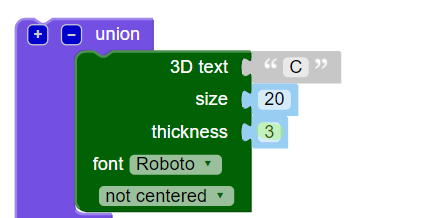

## 두께 변경하기

다음으로는, 글자 두께 변경으로 글자 사이를 분리하여 키링이 괜찮은 모양이 되게 합니다.

--- task ---

현재의 글자 두께는 2mm입니다.

'C', 'D', 'R'의 두께가 3mm가 되게 변경합니다.

--- hints ---
 --- hint ---

이 글자들의 텍스트 `두께` 값을 변경합니다.

--- /hint --- --- hint ---

'C', 'D', 'R'의 `두께` 값을 `3` 으로 변경해 'O', 'E'보다 두껍게 만듭니다.

--- /hint --- --- /hints ---

--- /task ---   
--- task ---

색상별 사각형을 눌러 출력보기에서의 모델 색상을 변경할 수 있습니다. 해당 모델을 3D 프린터로 출력할 땐 출력되는 키링 색상이 여러분이 사용하는 플라스틱 필라멘트를 따르게 되더라도 출력보기에서는 여러 색상을 시도해보는 것이 유용합니다.

또한 그리드를 보이기 또는 숨기기 할 수 있습니다. 그 외 다른 버튼도 다 눌러보며 기능을 확인해 보세요. 그 외 다른 버튼도 다 눌러보며 기능을 확인해 보세요.

해당 모델을 드래그하여 여러 각도에서 바라볼 수 있습니다.

--- /task ---
