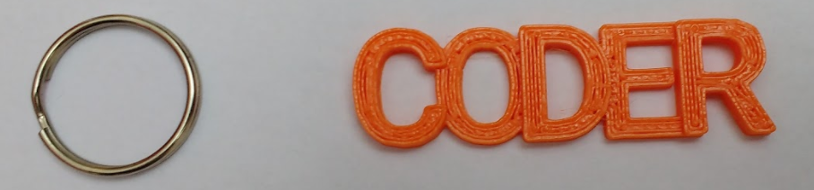

## 키링 조립하기

--- task ---

분리된 고리와 3D 프린터로 출력된 키링 예시:

--- /task --- --- task ---

분리된 고리를 3D 프린터로 출력된 키링에 부착한 예시:

--- /task ---	

***

이 프로젝트는 아래 자원 봉사자들에 의해 번역되었습니다:

Sunhee Moon
강태원

번역 봉사자들 덕분에 우리는 전 세계 사람들에게 프로그래밍을 모국어로 배울 수 있는 기회를 제공하고 있습니다. 번역 봉사에 동참해서 더 많은 사람들에게 프로그래밍을 배울 수 있는 기회를 제공하세요 - [rpf.io/translate](https://rpf.io/translate)에서 더 많은 정보를 확인하세요.