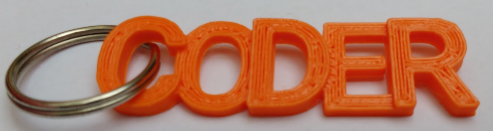

## Inleiding

In dit project gebruik je BlocksCAD om een 'CODER'-sleutelhanger te ontwerpen die 3D geprint kan worden.

BlocksCAD is een 3D-modeleditor die je kunt gebruiken in een webbrowser op een computer of tablet. Je sleept codeblokken en zet ze neer om 3D-modellen te ontwerpen die kunnen worden geëxporteerd voor 3D-printen.

Als je toegang hebt tot een 3D-printer, dan kun je jouw sleutelring printen. De sleutelhanger gebruikt niet veel filament en is klein en snel te 3D printen.

### Wat ga je maken

De voltooide sleutelhanger ziet er als volgt uit:

 

Je kunt een splitring door de opening tussen de 'C' en de 'O' steken om een sleutelhanger te maken.

De sleutelhanger meet ongeveer 14 mm bij 50 mm.

--- collapse ---
---
title: Wat heb je nodig
---

### Hardware

+ Een 3D-printer en filament. Effen kleuren werken het beste.
+ Een splitring voor het maken van de sleutelhanger. Een splitring met een diameter van 19 mm werkt goed.

### Software

+ Dit project kan worden voltooid in een webbrowser met BlocksCAD [blockscad3d.com/editor/](https://www.blockscad3d.com/editor){:target="_blank"}

--- /collapse ---

--- collapse ---
---
title: Wat ga je leren
---

+ Hoe je een eenvoudig 3D-object maakt dat 3D-geprint kan worden
+ Hoe te werken met X, Y en Z assen
+ Hoe `translate` te gebruiken om een 3D-object te positioneren

--- /collapse ---

--- collapse ---
---
title: Aanvullende informatie voor docenten
---

Als je dit project wilt afdrukken, gebruik dan de [printervriendelijke versie](https://projects.raspberrypi.org/nl-NL/projects/blockscad-coder-keyring/print){:target="_blank"}.

Download de voltooide projectcode op: [https://rpf.io/p/nl-NL/blockscad-coder-keyring-get](https://rpf.io/p/nl-NL/blockscad-coder-keyring-get).

--- /collapse ---
