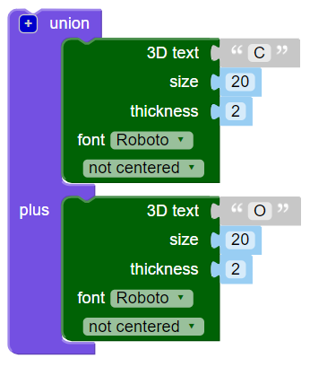

## Voeg de letters samen

Vervolgens ga je de letters samenvoegen zodat de sleutelhanger er als volgt uitziet:

--- task ---

Verander je code zodat deze alleen de letter 'C' creëert.

--- /task --- --- task ---

Het `union`{:class="blockscadsetops"} blok voegt vormen samen. Begin met de eerste twee letters van 'CODER'.

Blokken zijn kleurgecodeerd. Kijk onder `Set Ops`{:class="blockscadsetops"} om `union`{:class="blockscadsetops"} te vinden.

Merk op dat het `3D Text`{:class="blockscad3dshapes"} blok onder `Text`{:class="blockscadstext"} staat, ook al is het groen.

--- /task --- --- task ---

Klik op **Render** en je zult zien dat er een probleem is: de 'C' en de 'O' staan op dezelfde plek.

Je moet de 'O' langs de X-as verplaatsen zodat deze achter de 'C' komt.

--- /task --- --- task ---

Voeg een `translate`{:class="blockscadtransforms"} blok toe en stel de waarde van `X` in op `10` om de "O" 1mm langs de X-as te verplaatsen.

Nu moeten de letters elkaar raken, maar niet boven op elkaar.

--- /task --- --- task ---

Klik op de `[+]` knop op het `union`{:class="blockscadsetops"} blok om ruimte voor nog een blok toe te voegen.

--- /task --- --- task ---

Klik met de rechtermuisknop op het blok `translate`{:class="blockscadtransforms"} en selecteer **Duplicate** om een kopie te maken.

--- /task --- --- task ---

Sleep de kopie naar het `union`{:class="blockscadsetops"} blok en verander de 'O' in een 'D'.

--- /task --- --- task ---

Wijzig de waarde van `X` van het tweede `translate`{:class="blockscadtransforms"} blok, zodat de D op de juiste plaats zit.

--- hints ---
 --- hint ---

Denk aan wat je hebt veranderd om de 'O' achter de 'C' te verplaatsen. De 'D' begint op dezelfde plaats als de 'O' en je moet hem verplaatsen naar achter de 'O'.

--- /hint --- --- hint ---

    

--- /hint ------ /hints ---

--- /task --- --- task ---

Voeg nu een 'E' en een 'R' toe om het woord 'CODER' af te maken.

Zorg ervoor dat alle letters elkaar raken en dat er geen openingen zijn tussen de letters.

--- hints ---
 --- hint ---

Je moet op het blok `+` klikken op het blok `union`{:class="blockscadsetops"} om ruimte toe te voegen voor nog twee letters.

--- /hint --- --- hint ---

Je kunt de code die je hebt gebruikt om een 'D' te maken dupliceren en vervolgens de letters en de `X` waarden te wijzigen.

--- /hint --- --- hint ---

    

--- /hint ------ /hints ---

--- /task --- --- task ---

Kijk goed — zijn de 'E' en 'R' met elkaar verbonden? Als dat niet het geval is, moet je je code aanpassen.

--- /task ---

