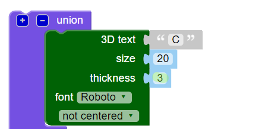
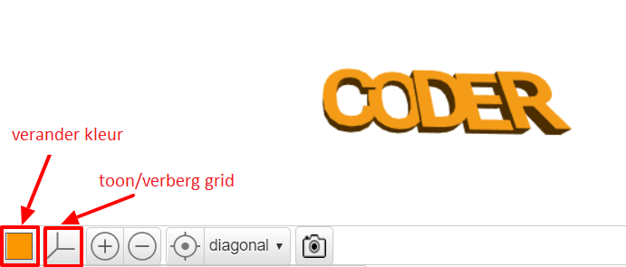

## Verander de dikte

Wissel vervolgens de dikte van de letters af om ze te scheiden en om je sleutelhanger nog beter te maken.

--- task ---

De letters zijn momenteel 2mm dik.

Verander de dikte van de 'C', 'D' en 'R' zodat ze 3mm dik zijn.

--- hints ---
 --- hint ---

Wijzig de `thickness` waarde van de tekst.

--- /hint --- --- hint ---

Wijzig de `thickness` waarde voor de 'C', 'D' en 'R' in `3`zodat ze dikker zijn dan de 'O' en 'E'.

--- /hint ------ /hints ---

--- /task ---   
--- task ---

Je kunt op het gekleurde vierkant klikken om de kleur van je model in de uitvoerweergave te wijzigen. Als je het model 3D print, hangt de kleur van de sleutelhanger af van de kleur van het plastic filament dat je gebruikt, maar het is handig om verschillende kleuren uit te kunnen proberen in de uitvoerweergave.

Je kunt ook het raster tonen en verbergen. Probeer de andere knoppen en kijk wat ze doen.

Je kunt je model rondslepen om het ook vanuit verschillende hoeken te bekijken.

--- /task ---
