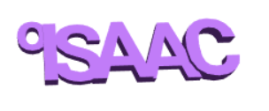

## Uitdaging: maak een sleutelhanger met je naam

Maak nu een 3D-tekstsleutelhanger of -badge met jouw naam of een ander woord of een korte zin.

Tips:
+ Zorg ervoor dat alle letters gekoppeld worden
+ Zorg ervoor dat de achterkant van je sleutelhanger plat en egaal is, anders wordt het erg moeilijk om te printen

Hier is een voorbeeld:

## Uitdaging: maak een sleutelhanger met verticale letters

Maak een sleutelhanger waarbij de letters verticaal in plaats van horizontaal aansluiten.

Hier is een voorbeeld:

--- hints ---
 --- hint ---

Deze keer moet je de `translate` van de letters langs de Y-as doen.

--- /hint ------ /hints ---

## Uitdaging: voeg een lus toe

Als er nergens is om een splitring aan het begin van je woord toe te voegen, dan kun je een kleinere letter 'o' toevoegen om een lus te maken.

Hier is een voorbeeld:

--- hints ---
 --- hint ---

Deze keer moet je `translate` van de 'o' langs de X- en Y-assen doen.

--- /hint ------ /hints ---

