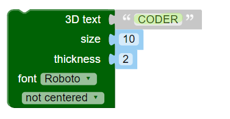

## Criar texto 3D

--- task ---

Abra o editor BlocksCAD em um navegador da web [blockscad3d.com/editor/](https://www.blockscad3d.com/editor/){:target="_blank"}.

Você pode arrastar e soltar blocos para escrever códigos para criar objetos 3D.

--- /task ---

Primeiro, use a ferramenta de texto 3D para criar algumas letras 3D.

--- task ---

Clique em `Text`{:class="blockscadtext"} e arraste um `3D Text`{:class="blockscadtext"} na tela.

--- /task --- --- task ---

Altere o `Texto 3D` para dizer 'CODER'.

--- /task --- --- task ---

Clique no botão **Render** para ver o resultado.

Renderizar é o processo de criação de uma imagem a partir de um modelo 3D para que possamos ver como ela se parece.

--- /task --- --- task ---

Para aumentar o tamanho das letras, altere o `size` para `20` — isso significa o tamanho 20 da fonte.

Clique no botão **Render** novamente para ver o resultado.

--- /task ---

Se imprimisse em 3D o modelo que criou agora, você obteria cinco letras separadas, porque elas não foram colocadas juntas. Isso não daria um chaveiro muito bom!

	

	
	

 
