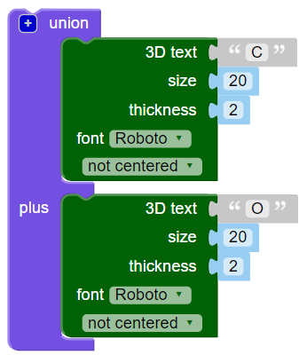
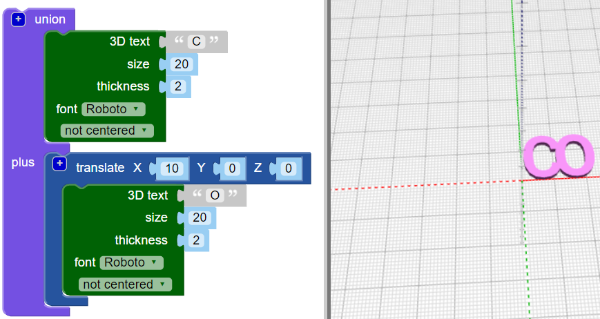

## Junte as letras

Em seguida, você juntará as letras para que o chaveiro fique assim:

--- task ---

Altere seu código para que ele crie apenas a letra 'C'.

--- /task --- --- task ---

O bloco `union`{:class="blockscadsetops"} faz as formas ficarem juntas. Comece com as duas primeiras letras de 'CODER'.

Blocos são codificados por cores. Procure em `Set Ops`{:class="blockscadsetops"} para encontrar `union`{:class="blockscadsetops"}.

Note que o bloco `3D Text`{:class="blockscad3dshapes"} é encontrado sob `Text`{:class="blockscadstext"}, mesmo que seja verde.

--- /task --- --- task ---

Clique em **Render** e você verá que há um problema: o 'C' e 'O' estão no mesmo lugar.

Você precisa mover o 'O' ao longo do eixo X para que ele apareça após o 'C'.

--- /task --- --- task ---

Adicione um bloco `translate`{:class="blockscadtransforms"} e defina o valor de `X` como `10` para mover o 'O' de 10mm ao longo do eixo X.

Agora, as letras devem estar tocando, mas não uma em cima da outra.

--- /task --- --- task ---

Clique no botão ` [+] ` em `union`{:class="blockscadsetops"} para adicionar um espaço para outro bloco.

--- /task --- --- task ---

Clique com o botão direito do mouse sobre o bloco `translate`{:class="blockscadtransforms"} e selecione **Duplicate** para criar uma cópia.

--- /task --- --- task ---

Arraste a cópia para o bloco `union`{:class="blockscadsetops"} e mude o 'O' para 'D'.

--- /task --- --- task ---

Altere o valor `X` do segundo bloco `translate`{:class="blockscadtransforms"} para que o 'D' esteja no lugar certo.

--- hints --- --- hint ---

Pense no que você mudou para mover o 'O' para depois do 'C'. O 'D' começa no mesmo lugar que o 'C', e você precisa movê-lo para depois do 'O'.

--- /hint --- --- hint ---

    

--- /hint --- --- /hints ---

--- /task --- --- task ---

Agora, adicione um "E" e um "R" para terminar a palavra "CODER".

Certifique-se de que todas as letras estão tocando e que não há lacunas entre qualquer uma das letras.

--- hints --- --- hint ---

Você precisa clicar no botão `+` no bloco `union`{:class="blockscadsetops"} para adicionar espaço para mais duas letras.

--- /hint --- --- hint ---

Você pode duplicar o código que você usou para criar um 'D' e, em seguida, alterar as letras e os valores de `X`.

--- /hint --- --- hint ---

    

--- /hint --- --- /hints ---

--- /task --- --- task ---

Olhe atentamente - o 'E' e 'R' estão juntos? Se eles não estão, você precisa ajustar seu código.

--- /task ---

