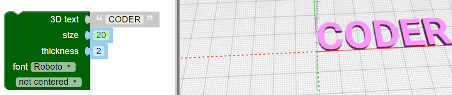

## Створи 3D-текст

--- task ---

Відкрий редактор BlocksCAD у веббраузері на [blockcad3d.com/editor/](https://www.blockscad3d.com/editor/){:target="_ blank"}.

Ти можеш перетягувати блоки коду для створення 3D-об’єктів.

--- /task ---

Спочатку використай інструмент text (текст) для створення 3D-літер.

--- task ---

Клацни на `Text`{:class="blockscadtext"}, а далі перетягни блок `3D Text`{:class="blockscadtext"} в робочу область.

--- /task --- --- task ---

Введи "CODER" як параметр для `3D text`.

--- /task --- --- task ---

Натисни на кнопку **Render** (Візуалізувати), щоб побачити результат.

Візуалізація — це процес створення зображення з 3D-моделі, щоб побачити як вона виглядає.

--- /task --- --- task ---

Щоб збільшити літери, зміни `size` (розмір) на `20` — це означає, що розмір шрифта буде 20.

Клацни **Render** знову, щоб переглянути результат.

--- /task ---

Якщо ти надрукуєш цю модель на 3D-принтері, ти отримаєш п’ять окремих літер, тому що вони не з’єднані між собою. Таким чином у нас не вийде хороший брелок для ключів!

	

	
	

 
