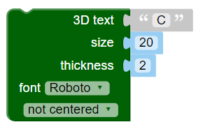

## З’єднай літери

Далі ти з’єднаєш літери, щоб брелок виглядав ось так:

--- task ---

Зміни свй код, щоб він створював тільки літеру "C".

--- /task --- --- task ---

Блок `union`{:class="blockscadsetops"} (об’єднання) з’єднує фігури. Розпочни із перших двох літер слова "CODER".

Блоки мають певні кольори. Заглянь в розділ `Set Ops`{:class="blockscadsetops"}, щоб знайти блок `union`{:class="blockscadsetops"}.

Зверни увагу, що блок `3D Text`{:class="blockscad3dshapes"} знаходиться в розділі `Text`{:class="blockscadstext"}, незважаючи на те, що він зелений.

--- /task --- --- task ---

Клацни **Render** і ти побачиш, що є проблема: "C" та "O" знаходяться в одному місці.

Тобі треба перемістити «O» по осі X, щоб вона йшла після «C».

--- /task --- --- task ---

Додай блок `translate`{:class="blockscadtransforms"} (перемістити) і встанови значення `X` рівне `10`, щоб перемістити «O» на 10 мм вздовж осі X.

Тепер ці літери мають дотикатися, але не закривати одна одну.

--- /task --- --- task ---

Клацни кнопку `[+]` у блоці `union`{:class="blockscadsetops"}, щоб додати місце для ще одного блока.

--- /task --- --- task ---

Клацни правою кнопкою мишки на блок `translate`{:class="blockscadtransforms"} і вибери **Duplicate** (дублювати) для створення копії.

--- /task --- --- task ---

Перетягни цю копію в блок `union`{:class="blockscadsetops"} і зміни «O» на «D».

--- /task --- --- task ---

Зміни значення `X` в другому блоці `translate`{:class="blockscadtransforms"}, щоб «D» була в правильному місці.

--- hints --- --- hint ---

Подумай що ти змінив(-ла), щоб «O» стала після «C». «D» розпочинає з того ж місця, що й «C», а тобі требе перемістити її після «O».

--- /hint --- --- hint ---

    

--- /hint --- --- /hints ---

--- /task --- --- task ---

Тепер додай літери «E» та «R» щоб завершити слово «CODER».

Переконайся, що всі літери дотикаються і між ними немає проміжків.

--- hints --- --- hint ---

Тобі треба використовувати `+` блока `union`{:class="blockscadsetops"}, щоб додати місця ще для двох літер.

--- /hint --- --- hint ---

Ти можеш продублювати код для створення «D», а потім змінити літери та значення `X`.

--- /hint --- --- hint ---

    

--- /hint --- --- /hints ---

--- /task --- --- task ---

Look closely — are the 'E' and 'R' joined together? If they are not, you need to adjust your code.

--- /task ---

