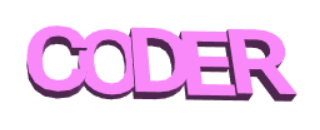

## Зміни товщину

Далі чергуй товщину літер, щоб краще їх відділити одну від одної і зробити свій брелок іще кращим.

--- task ---

Наразі товщина літер складає 2 мм.

Зміни товщину «C», «D», та «R» до 3 мм.

--- hints ---
--- hint ---

Зміни параметр тексту `thickness` (товщина).

--- /hint ---
--- hint ---

Зміни параметр `thickness` для «C», «D» та «R» до `3`, щоб вони стали товстішими за «O» та «E».

--- /hint ---
--- /hints ---

--- /task ---	
 
--- task ---

Ти можеш клацнути на кольоровий квадратик, щоб змінити колір своєї моделі у вікні показу. Коли ти друкуватимеш свою модель, то колір брелока буде залежати від кольору пластику, який ти візьмеш, але корисно поекспериментувати із різними кольорами у вікні виводу.

Також ти можеш показати або сховати сітку. Випробуй інші кнопки і подивися, що вони роблять.

Ти можеш перетягувати модель, щоб побачити її з різних сторін.

--- /task ---
